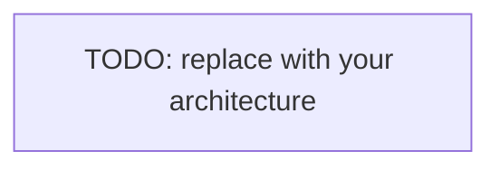

# 01 — PRD & Architecture Spec

> **Template.** The approved design contract. Fill by hand, or generate it with `/spec`
> (skill: spec-driven-development). Optional: `/excalidraw-spec` renders the architecture
> diagram via the excalidraw MCP server. Mark Status `approved` before `/plan`. Delete this
> note once filled.

- Status: **DRAFT — awaiting human approval** (reply `approved` or `change: 
`)
- Date: <!-- TODO -->
- Traces to: [`00-requirements.md`](./00-requirements.md)

## 1. Goal
<!-- TODO: 2–4 sentences. The outcome and the dominant correctness/quality constraint. -->

## 2. Non-goals
<!-- TODO: explicit exclusions. -->

## 3. Architecture
<!-- TODO: the request/data lifecycle. Inline a Mermaid diagram or link an Excalidraw export. -->

## 4. Components
<!-- TODO: module/package layout and the responsibility of each. Note what is deliberately
NOT abstracted (avoid speculative generality). -->

## 5. Data model
<!-- TODO: tables / schemas / key entities + important indexes & invariants. -->

## 6. Interfaces / API
<!-- TODO: endpoints, message shapes, or public function signatures. Reference the validating
schema so docs and validation can't drift. -->

## 7. Key decisions & algorithms
<!-- TODO: the few non-obvious, highest-risk decisions; pseudo-code where it helps. -->

## 8. Observability
<!-- TODO: logs, metrics, traces; what to alert on. -->

## 9. Security
<!-- TODO: trust boundaries, input validation, secret handling, authz. -->

## 10. Assumptions & tradeoffs
<!-- TODO: what you assumed, and what you knowingly traded away. -->

## 11. Open questions
<!-- TODO: anything still unresolved that needs a human decision. -->
