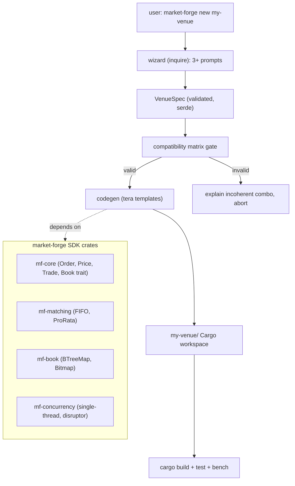

# 01 — PRD & Architecture Spec

- Status: **approved** (autonomous `/goal` run; revisit decisions in `docs/architecture.md`)
- Date: 2026-05-29
- Traces to: [`00-requirements.md`](./00-requirements.md)

## 1. Goal
Ship a Rust CLI + SDK that turns matching-engine design choices into a tailored, **compiling,
testable, benchable** Cargo workspace. The dominant correctness constraint: every generated
venue builds, passes golden tests, and runs Criterion benches; money math is deterministic
(no `f64`). The full algorithm catalog (Mermaid + plain-language) is the documentation half
of the product.

## 2. Non-goals
Remote fork/push/deploy (human-only). Live exchange connectivity. Third-party plugin
discovery (post-MVP). MVP wizard beyond 3 prompts.

## 3. Architecture
Two halves: (a) the **forge** (CLI/wizard/codegen + SDK crates) lives in this workspace;
(b) the **generated venue** is a fresh Cargo workspace stamped from Tera templates that
depend on the published SDK crates (or path-deps in dev).

## 4. Components
Forge workspace (`market-forge/`):
- `crates/mf-core` — domain types: `Price` (decimal), `Qty`, `OrderId`, `Side`, `Order`,
  `Trade`, the `OrderBook` trait, `MatchingEngine` trait. No I/O.
- `crates/mf-matching` — `FifoMatcher`, `ProRataMatcher` (impl `MatchingEngine`).
- `crates/mf-book` — `BTreeBook`, `BitmapBook` (impl `OrderBook`).
- `crates/mf-concurrency` — `SingleThread` runner + `DisruptorRunner` (ring-buffer sequencer).
- `crates/mf-codegen` — `VenueSpec`, compatibility matrix, Tera template rendering.
- `crates/market-forge` (bin) — `clap` CLI + `inquire` wizard; `new`, `list`, `validate`.
- `templates/` — Tera templates for the generated venue (Cargo.toml.tera, main.rs.tera,
  engine wiring, golden tests, criterion bench, README, optional `-tui`/`-web` bins).
- `docs/` — `architecture.md`, `standards.md`, `catalog/` (the ~70 algorithm entries).
- Deliberately NOT abstracted: no plugin/registry system in MVP (YAGNI until v0.2); no async
  on the matching path.

## 5. Data model
No database. Core entities (in-memory):
- `Order { id, side, price: Decimal, qty: Decimal, ts }`
- `Trade { taker, maker, price, qty, ts }`
- `PriceLevel { price, FIFO queue of resting orders }`
- Book invariant: bids sorted desc, asks asc; no crossed book after match; qty conserved
  (Σ filled = Σ reduced resting + taker fill). WAL/event-sourcing optional (CLA-145).

## 6. Interfaces / API
- CLI: `market-forge new <name>`, `market-forge list [category]`, `market-forge validate <spec.toml>`.
- `VenueSpec` (serde, validated): `{ matching: Fifo|ProRata, book: BTreeMap|Bitmap,
  concurrency: SingleThread|Disruptor, .. }`.
- SDK traits:
  - `trait OrderBook { fn add(&mut self, o: Order); fn best_bid/ask(&self) -> Option<Price>; .. }`
  - `trait MatchingEngine { fn submit(&mut self, o: Order) -> Vec<Trade>; }`

## 7. Key decisions & algorithms
Full decision log in `docs/architecture.md` (CLA-136). Headlines: single canonical entry
`market-forge new`; `inquire` wizard; Tera templates (swap parts, path-dep the SDK); SDK as
multiple small crates; compatibility matrix as a data-driven rules table; native
re-implementation of OrderBook-rs lineage (Disruptor = default concurrency template).

## 8. Observability
`tracing` with env-filter; sampled spans off the hot path. Generated `-tui`/`-web` surface
live latency. Criterion reports are the perf record of truth.

## 9. Security
No secrets; no network in unit tests. Validate `VenueSpec` and any spec file at the boundary
(serde + explicit validators; reject unknown/incoherent combos). `cargo audit` gate. Money
math deterministic to avoid rounding-exploit drift.

## 10. Assumptions & tradeoffs
Native re-implementation (not a vendored fork) chosen because hard rules forbid remote fork
and to keep licensing clean; we trade "literal upstream code reuse" for "clean MIT/Apache
lineage with attribution". Multiple small SDK crates trade dependency-graph noise for
`cargo add` granularity. Tera over `syn`/`quote` trades AST precision for template clarity
(sufficient because the SDK absorbs the complex code; templates just wire choices).

## 11. Open questions
- Final product name (placeholder "Market Forge") — resolved in `docs/architecture.md`.
- Coverage tooling availability (`cargo llvm-cov`) — fall back to documented manual evidence.
