<div align="center">

```
███╗   ███╗ █████╗ ██████╗ ██╗  ██╗███████╗████████╗   ███████╗ ██████╗ ██████╗  ██████╗ ███████╗
████╗ ████║██╔══██╗██╔══██╗██║ ██╔╝██╔════╝╚══██╔══╝   ██╔════╝██╔═══██╗██╔══██╗██╔════╝ ██╔════╝
██╔████╔██║███████║██████╔╝█████╔╝ █████╗     ██║      █████╗  ██║   ██║██████╔╝██║  ███╗█████╗
██║╚██╔╝██║██╔══██║██╔══██╗██╔═██╗ ██╔══╝     ██║      ██╔══╝  ██║   ██║██╔══██╗██║   ██║██╔══╝
██║ ╚═╝ ██║██║  ██║██║  ██║██║  ██╗███████╗   ██║      ██║     ╚██████╔╝██║  ██║╚██████╔╝███████╗
╚═╝     ╚═╝╚═╝  ╚═╝╚═╝  ╚═╝╚═╝  ╚═╝╚══════╝   ╚═╝      ╚═╝      ╚═════╝ ╚═╝  ╚═╝ ╚═════╝ ╚══════╝
```

# 🔨 Market Forge

**Answer a few questions about your matching engine. Get a compiling, testable, benchable Rust venue.**


</div>

> **Design lineage / attribution.** Market Forge's default concurrency template (the LMAX/DMAX
> Disruptor) and initial order-book design are inspired by
> [**joaquinbejar/OrderBook-rs**](https://github.com/joaquinbejar/OrderBook-rs) by Joaquín Béjar
> García. Market Forge is a **native re-implementation with attribution**, not a vendored fork —
> everything in `crates/`, `templates/`, the wizard, and the algorithm catalog is original. See
> [`NOTICE.md`](./NOTICE.md).

---

## The one-liner

A matching engine is a stack of orthogonal design choices — *how do orders match? how is the
book stored? how does it run concurrently?* — and each choice has real trade-offs. **Market Forge
turns those choices into a working Cargo workspace** and documents the trade-offs in a 78-entry
[algorithm catalog](docs/catalog/).

```console
$ market-forge new my-clob
? Matching algorithm   › FIFO (price-time)
? Book data structure  › BTreeMap
? Concurrency model    › Single-thread
✔ Generated my-clob/  →  cargo build · cargo test · cargo bench   (all green)
```

## Quick start

```bash
cargo install --path crates/market-forge          # puts `market-forge` on $PATH
market-forge new my-clob                           # interactive wizard
# …or fully headless, with the live visualizers:
market-forge new my-clob \
  --matching fifo --book btreemap --concurrency disruptor --tui --web
cd my-clob && cargo build --release && cargo test && cargo bench
```

Prefer code to a wizard? Every primitive is a small SDK crate: `cargo add mf-core mf-matching
mf-book mf-concurrency`.

---

## How it works

`market-forge new` runs a five-stage pipeline. Your answers become a validated `VenueSpec`,
that spec is checked against a **compatibility matrix**, and Tera templates stamp out a workspace
whose engine is wired from the **SDK crates** — so the generator stays thin and the heavy,
tested logic lives in the library.

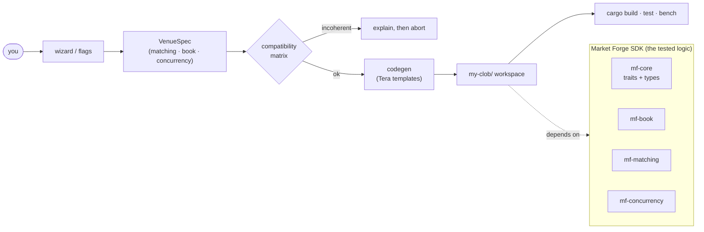

### The engine you get is one generic type

Every generated venue is the **same shape** — a concurrency *runner* wrapping a *matcher*
wrapping a *book* — and each wizard answer just swaps one slot:

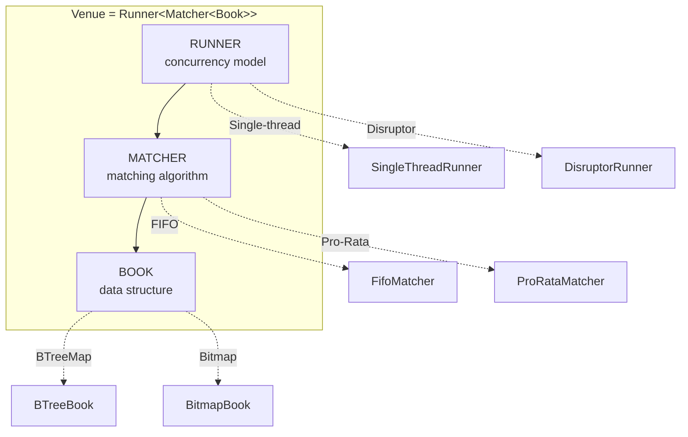

So the three answers compose into a concrete type. The MVP's 2×2×2 grid:

| matching | book | concurrency | → generated `Venue` type |
|----------|------|-------------|--------------------------|
| `fifo` | `btreemap` | `single-thread` | `SingleThreadRunner<FifoMatcher<BTreeBook>>` |
| `fifo` | `bitmap` | `disruptor` | `DisruptorRunner<FifoMatcher<BitmapBook>>` |
| `pro-rata` | `btreemap` | `single-thread` | `SingleThreadRunner<ProRataMatcher<BTreeBook>>` |
| `pro-rata` | `bitmap` | `disruptor` | `DisruptorRunner<ProRataMatcher<BitmapBook>>` |

### Which combinations are allowed?

The matrix gates generation — green is natural, yellow is workable-with-a-caveat, red aborts
with a reason (the red example is post-MVP, e.g. an LMSR prediction maker over a CLOB matcher).

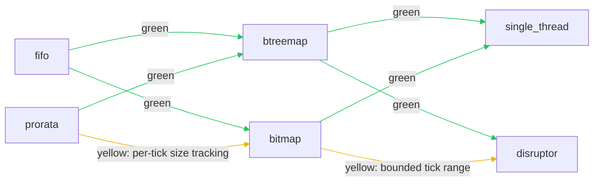

---

## How each choice changes the engine

### 1. Matching algorithm — *who fills first?*

**FIFO (price-time):** at the best price, the **oldest** resting order fills first. A
latency-rewarding, intuitive discipline (NYSE, Nasdaq, most crypto spot).

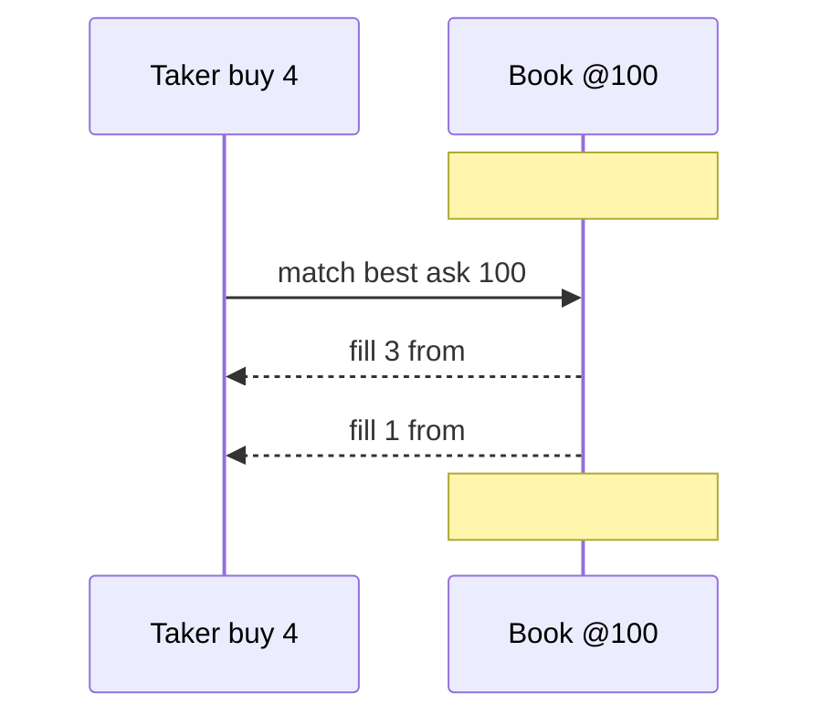

**Pro-Rata:** at the best price, the fill is split across **every** resting order in proportion
to size (rewards large quotes; CME interest-rate futures). Same taker, different outcome:

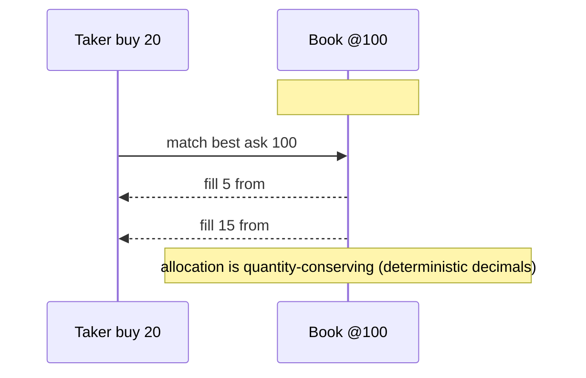

> Swap `--matching fifo` ↔ `--matching pro-rata` and the generated `tests/golden.rs` changes its
> assertions to match the discipline — the venue always ships tests that prove *its own* behavior.

### 2. Book data structure — *where does liquidity live?*

**BTreeBook** — a `BTreeMap<Price, queue>` per side. Unbounded, idiomatic, `O(log n)` best-price.

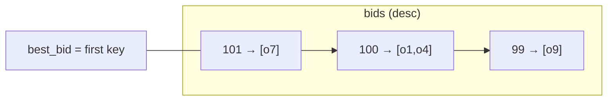

**BitmapBook** — a bitmap of occupied ticks over a *bounded* range; best-price is the
highest/lowest set bit (`O(1)`-amortized). Best when the tick range is known.

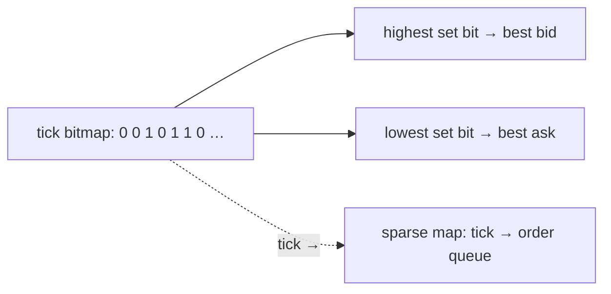

### 3. Concurrency model — *how do orders reach the matcher?*

**SingleThreadRunner** — apply each order inline. Simplest, fully deterministic.

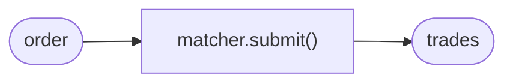

**DisruptorRunner** — orders are *published* into a pre-allocated ring buffer; a consumer cursor
drains them in sequence (the LMAX pattern — no per-order allocation on the hot path).

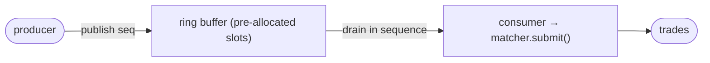

---

## Visualize it

`--tui` and `--web` add optional binaries to the generated venue, fed by a deterministic order
simulator:

- **`<venue>-tui`** (ratatui) — live depth ladder, last price, trade tape, and per-order match
  latency in the terminal.
- **`<venue>-web`** (axum) — a self-contained page (no npm install) that streams depth over a
  WebSocket and plots price with **TradingView Lightweight Charts**.

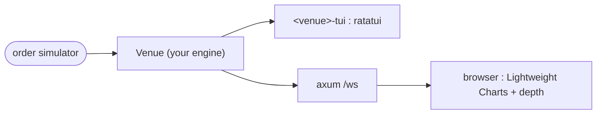

---

## SDK architecture

The forge is thin; the SDK is where the tested matching logic lives. Generated venues depend on
these crates (path deps in dev; version deps once published).

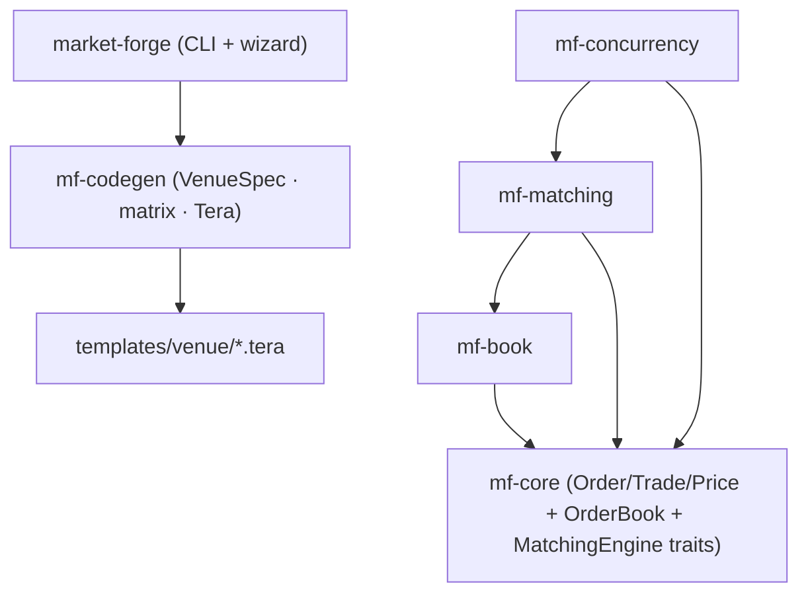

## Repo layout

| Path | Purpose |
|------|---------|
| `crates/mf-core` | Domain types + `OrderBook` / `MatchingEngine` traits (decimal money, no `f64`) |
| `crates/mf-book` | `BTreeBook`, `BitmapBook` |
| `crates/mf-matching` | `FifoMatcher`, `ProRataMatcher` |
| `crates/mf-concurrency` | `SingleThreadRunner`, `DisruptorRunner` |
| `crates/mf-codegen` | `VenueSpec`, compatibility matrix, Tera rendering |
| `crates/market-forge` | The `market-forge` CLI + `inquire` wizard |
| `templates/venue/` | Tera templates stamped into generated venues |
| `docs/architecture.md` | The 9 design decisions (architecture spike) |
| `docs/standards.md` | Diagram + doc conventions, crates inventory |
| `docs/catalog/` | The [78-entry algorithm catalog](docs/catalog/README.md) |

## Algorithm catalog

78 entries across 8 categories — each a Mermaid diagram + a ≤300-word plain-language note
(what it is · when to pick · when not · real venue · recommended crate). Browse the
[index](docs/catalog/README.md): matching (10) · books (9) · concurrency (10) · risk (13) ·
liquidation (8) · perps (6) · prediction makers (10) · infrastructure (12).

## Design constraints

- **A generated workspace must always build, test, and bench.** A generator that emits broken
  code is worthless.
- **Deterministic money math** — `rust_decimal::Decimal`, never `f64`.
- **Lock-free matching hot path** — no required async runtime on it.
- **Permissive licensing only** — no GPL/LGPL dependency.

See [`CONTRIBUTING.md`](./CONTRIBUTING.md) for the full Definition of Done.

## License

Dual-licensed under either [MIT](./LICENSE-MIT) or [Apache-2.0](./LICENSE-APACHE), at your option.

---

<sub>Developed with a cross-tool agent contract under `.ai/` (Claude Code, Cursor, Codex, Gemini
CLI, opencode), generated by `bun run sync:ai`. See `AGENTS.md`.</sub>
