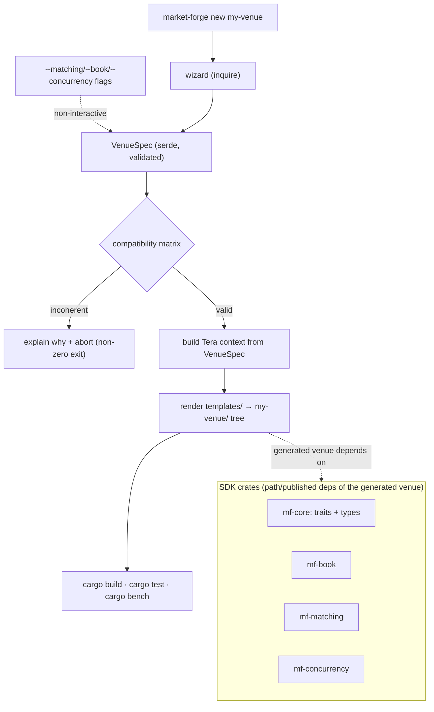
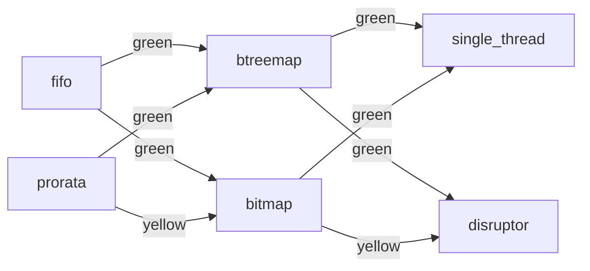

# Market Forge — Architecture Spike (CLA-136)

> The design contract. Decisions here are committed for v0.1; revisit via ADR if reality
> disagrees. Traces to `.ai/specs/01-spec.md`.

## User-facing flow + codegen pipeline



## Decision log (the 9 decisions)

1. **Fork sequencing.** Native re-implementation with attribution — NOT a vendored fork (the
   agent contract forbids remote forks, and a clean MIT/Apache lineage avoids dragging in
   upstream license terms). `main` holds Market Forge; OrderBook-rs is credited in `NOTICE.md`.
   *Rejected:* git-subtree vendor (license + sync complexity), hard binary fork (loses
   attribution clarity).
2. **CLI surface.** One canonical entry point: `market-forge new <name>` (installed via
   `cargo install --path crates/market-forge`). *Rejected:* a `cargo market-forge` subcommand
   (extra discovery friction for v0.1; can add later as a thin shim).
3. **Interactive flow.** A single short wizard (3 prompts for MVP, growing to ~7) using
   **`inquire`** (nice select UX, good non-TTY fallback). Every prompt also has a CLI flag so
   the wizard is fully scriptable/testable headless. *Rejected:* layered REPL (overkill),
   `dialoguer` (less ergonomic selects), `clap`-only (no guided UX).
4. **SDK surface.** Several small crates (`mf-core`, `mf-book`, `mf-matching`,
   `mf-concurrency`) so non-CLI users `cargo add` exactly what they need, composing through
   `mf-core` traits. *Rejected:* one umbrella crate with feature flags (feature-combination
   blow-up, fuzzier docs).
5. **Codegen strategy.** **Tera templates** that wire user choices together; the heavy logic
   lives in the SDK crates, so templates stay thin and mostly *select which SDK type to
   instantiate*. This lets us swap PARTS of the generated tree (one template per file) instead
   of regenerating everything. *Rejected:* `syn`+`quote` AST building (precise but verbose for
   what is mostly wiring), declarative macros (poor cross-file composition).
6. **Plugin model.** **Deferred to v0.2** (YAGNI for MVP). When added: a trait-based registry
   keyed by `VenueSpec` enum variants, discovered at build time via Cargo features — no
   `inventory`/global-ctor magic. MVP hard-codes the known algorithms in `mf-codegen`.
7. **Combination matrix.** A data-driven rules table in `mf-codegen` maps each pair/triple of
   choices to `Natural | Workable | Incoherent`. Generation aborts on `Incoherent` with a
   human-readable reason (e.g. "LMSR is a prediction-market maker; it does not compose with a
   CLOB FIFO matcher"). Rendered as a colored `graph` per `docs/standards.md` §1.
8. **Output shape.** `market-forge new my-venue` produces:
   ```text
   my-venue/
     Cargo.toml            # workspace; deps on the chosen mf-* crates
     README.md             # what was generated + why (echoes the choices)
     crates/
       engine/             # wires book + matcher + concurrency from the spec
         src/lib.rs
         benches/match.rs  # criterion
         tests/golden.rs   # golden matching behavior
     # optional, by flag:
       <venue>-tui/        # ratatui visualization (CLA-148)
       <venue>-web/        # axum + TradingView charts (CLA-149)
   ```
9. **Naming.** Keep **"Market Forge"** — evocative, available, matches the `forge`/`new` verb
   model. *Considered & rejected:* "OrderForge" (too close to upstream name), "Bookwright"
   (obscure), "MatchKit" (generic). Crate prefix `mf-` for the SDK.

## What we inherit from OrderBook-rs vs what's new

| Inherited (design lineage, re-implemented) | New in Market Forge |
|--------------------------------------------|---------------------|
| LMAX/DMAX Disruptor concurrency pattern (default concurrency template) | The wizard + CLI generator |
| Price-time order-book mental model | `mf-codegen` (VenueSpec, matrix, Tera templates) |
| Decimal-based deterministic pricing discipline | The multi-crate SDK split + `OrderBook`/`MatchingEngine` traits |
|  | The full algorithm catalog (~70 entries) |
|  | TUI + web visualizations |

## Combination matrix (MVP scope)



- All four MVP matching×book combos are at least *workable*; `prorata`×`bitmap` is `yellow`
  (bitmap levels need per-order qty tracking for pro-rata allocation — supported but heavier).
- Post-MVP incoherent example: `lmsr` (prediction-market maker) × `fifo` (CLOB matcher) →
  `red`, aborted by the matrix gate.
