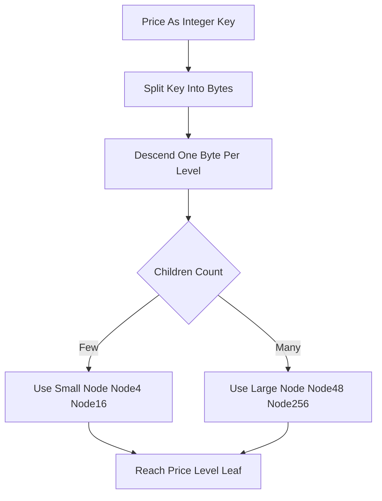

# Adaptive Radix Tree (ART) Book

**What it is.** A limit order book (resting orders sorted by price) stored in an Adaptive Radix Tree, a tree that indexes a price by the bytes of its integer key and resizes each node (4, 16, 48, or 256 slots) to fit how many children it actually has.

**When to pick this.** Your prices are dense integer tick keys, and you want cache-friendly lookups: ART packs small nodes tightly so a price walk touches few cache lines. Operations cost O(k) where k is the number of key bytes (a small constant, e.g. 4 or 8), so insert, cancel, and best-quote are effectively constant-time and independent of how many price levels exist.

**When NOT to pick this.** Prices are sparse or non-integer (the byte-splitting trick loses its density advantage), you need a dead-simple structure to audit (ART's four node types add real implementation complexity), or a plain array over a known bounded range would already give O(1) with less code.

**Real venue.** No production user known (ART itself ships in HyOrder/HyPer-style databases).

**Recommended crate.** none — std (hand-rolled; no inventory ART crate)
