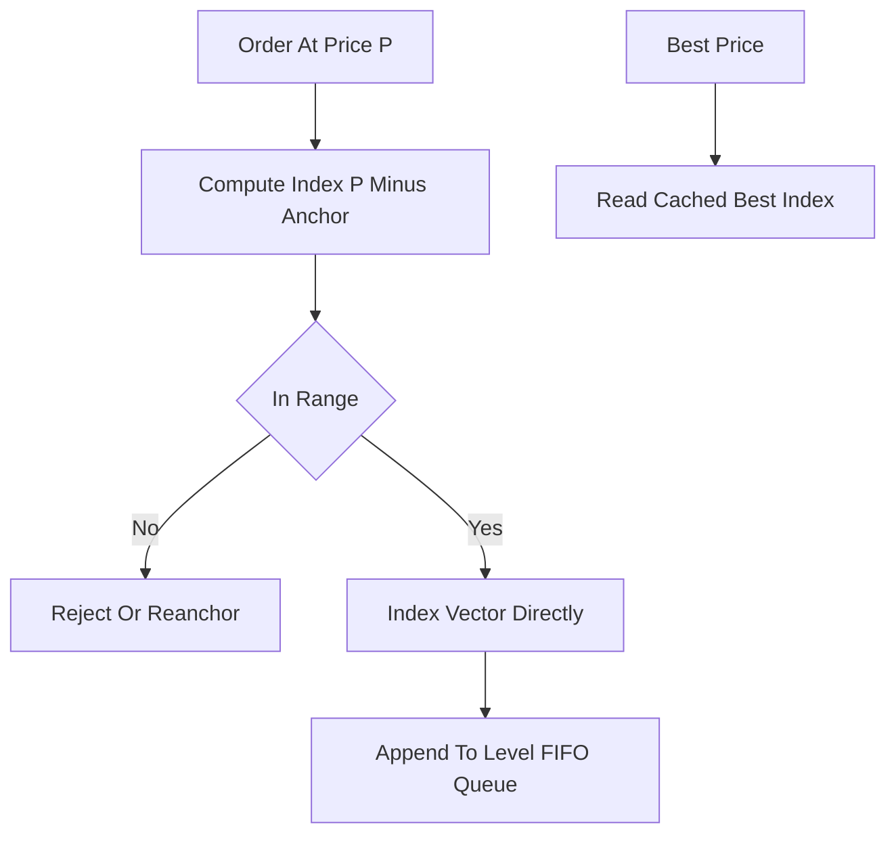

# Array-Based Price Ladder

**What it is.** A limit order book stored as a flat vector where each slot is one tick (discrete price) and the index is computed as `index = (price - anchor) / tick_size`, so a price maps straight to a memory cell.

**When to pick this.** You control the price range and tick size (so you know the array bounds up front) and want the lowest possible latency. Indexing is direct address arithmetic, making insert and cancel O(1); best-quote is O(1) too if you cache the best index and nudge it as levels empty or fill. Contiguous memory also means excellent cache behavior.

**When NOT to pick this.** The range is unbounded, very wide, or sparsely used — the vector reserves a slot for every tick in range, so a huge thin book wastes memory, and a price outside the range forces a costly reject or re-anchor (shifting the whole array).

**Real venue.** Nasdaq ITCH-style and many low-latency HFT matching engines use a preallocated price-array ladder for their tightly bounded tick grids.

**Recommended crate.** slab (for the per-level order node pool backing each slot; the ladder itself is a `Vec`)
