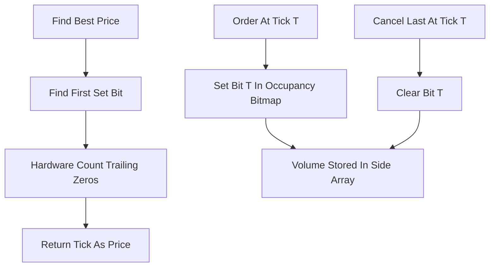

# Bitmap / Bit-Indexed Book

**What it is.** A limit order book where a single bit per tick (a discrete price slot) marks whether any order rests at that price, packed into machine words so the whole occupied-price set fits in a tiny bitmap.

**When to pick this.** Prices span a bounded tick range you control, and you want the absolute fastest book operations. Setting or clearing a bit is O(1), and the best bid or ask is found with one hardware "count trailing zeros" instruction — also O(1). For a range wider than 64 ticks you layer bitmaps (a summary word pointing at sub-words), keeping best-quote at a couple of constant-time steps.

**When NOT to pick this.** Prices are unbounded or extremely wide and sparse (the bitmap reserves a bit for every tick whether used or not, wasting memory), or you need per-order detail at a level — the bitmap only says "occupied", so you pair it with a side array holding the actual queues and volumes.

**Real venue.** No production user known.

**Recommended crate.** none — std (raw `u64` words plus `trailing_zeros`)
