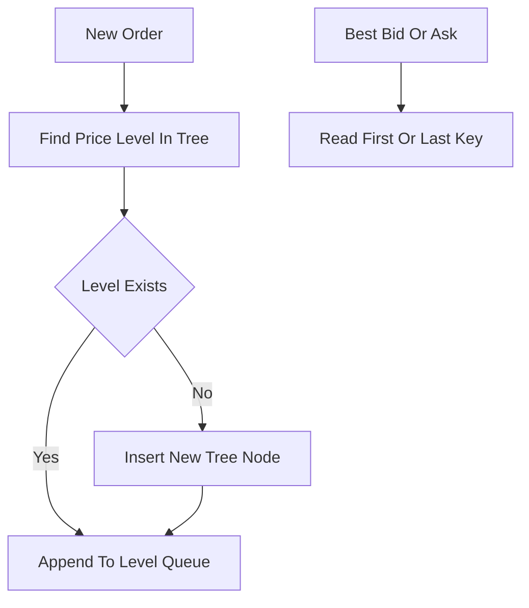

# BTreeMap Book

**What it is.** A limit order book (the list of resting buy and sell orders, keyed by price) built on Rust's standard `BTreeMap<Price, PriceLevel>`, a balanced sorted tree that keeps prices in order automatically.

**When to pick this.** You want the simplest correct book that any reader can audit, prices are unbounded or sparse, and you value safe idiomatic standard-library code over squeezing out nanoseconds. Insert and cancel are O(log n) (where n is the number of distinct price levels); reading the best bid or ask is also O(log n) because it walks to the first or last key.

**When NOT to pick this.** You are in a latency-critical hot path where the cache-miss-heavy tree traversal hurts, or your prices are dense bounded integers (ticks) where an array or bitmap gives O(1) access.

**Real venue.** No production user known (it is the common reference/teaching baseline; real exchanges use specialized structures).

**Recommended crate.** none — std
