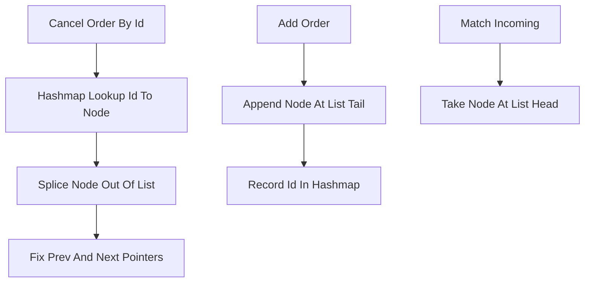

# Hash + Doubly-Linked List per Level

**What it is.** A price level (all resting orders at one price) held as a doubly-linked list so orders keep first-in-first-out (FIFO) arrival order, paired with a hash map from `order_id` to that order's list node.

**When to pick this.** You must cancel a specific order by its id instantly and preserve fair FIFO matching within each price. The hash map turns "find this order" into an O(1) lookup, and because the node carries `prev`/`next` pointers, unlinking it is also O(1) — no scanning the queue. Appending a new arrival at the tail is O(1), and matching always takes the head, also O(1).

**When NOT to pick this.** A single-threaded toy where a simple vector per level suffices, or memory-constrained systems — every order pays for two extra pointers plus a hash-map entry, and pointer-chasing lists are less cache-friendly than arrays.

**Real venue.** This id-map-plus-FIFO-list pattern is the textbook design behind production matching engines such as those documented for LMAX and many crypto exchanges.

**Recommended crate.** dashmap (concurrent id-to-node map; pair with slab-backed list nodes)
