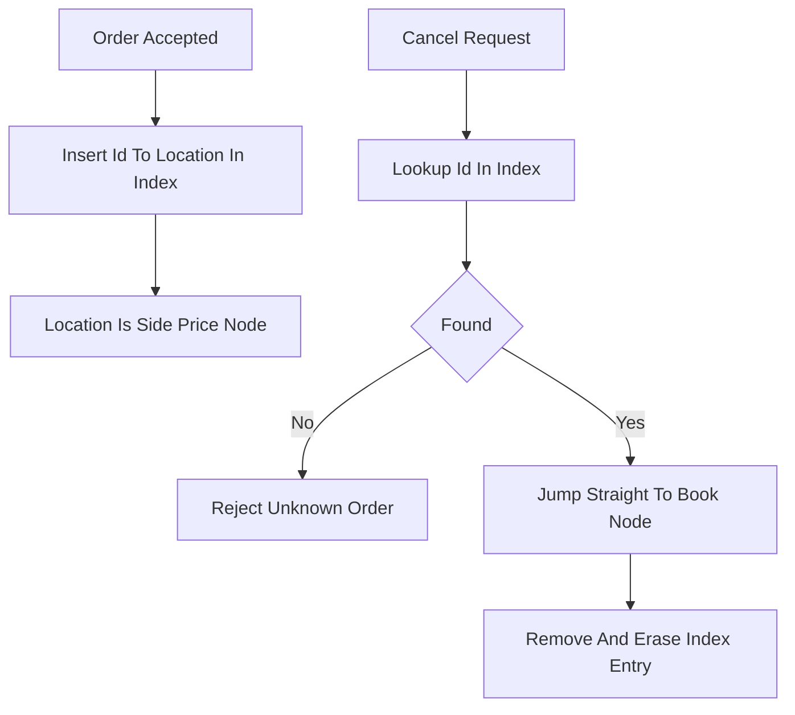

# Order ID to Location Index

**What it is.** A companion side table — a fast hash map from each live `order_id` to where that order physically sits in the book (its side, price level, and node) — so a cancel never has to search.

**When to pick this.** Any book design needs this: cancels and modifies arrive by order id, not by price, so without an index you would scan price levels to find an order. The map turns that into an O(1) lookup, then you jump directly to the node and unlink it. Pair it with a structure (linked list, slab) whose nodes can be removed in O(1) once located. It is required, not optional, for real cancel performance.

**When NOT to pick this.** Essentially never for a real venue; skip it only in a read-only book replay or analytics view where no cancels happen and the extra map is pure overhead.

**Real venue.** Every production matching engine (Nasdaq, CME, Binance, LMAX) maintains an order-id index for O(1) cancel.

**Recommended crate.** dashmap (concurrent; or a single-thread `FxHashMap`/`AHashMap` for raw speed)
