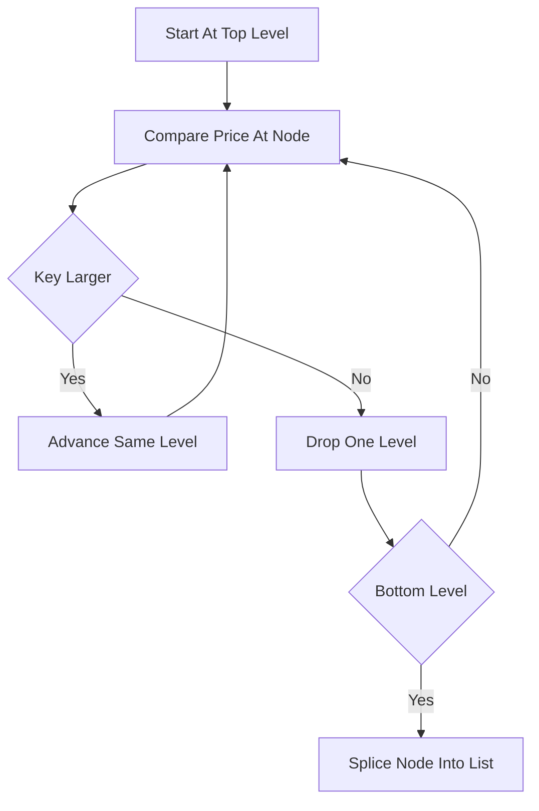

# Skip List Book

**What it is.** A limit order book (the sorted list of resting orders by price) stored in a skip list, a layered linked list where each node randomly gets extra "express lane" pointers so searches skip ahead instead of stepping one by one.

**When to pick this.** You need a concurrent book that many threads read and write at once, and you want lock-free updates that are far simpler to implement correctly than a lock-free balanced tree. Insert, cancel, and best-quote are all O(log n) on average (n = price levels), but the probabilistic structure means no costly tree rotations to coordinate across threads.

**When NOT to pick this.** Single-threaded code where a `BTreeMap` is simpler, or memory-tight systems (the extra pointer lanes cost roughly two pointers per node on average).

**Real venue.** No production user known.

**Recommended crate.** crossbeam (crossbeam-skiplist for the lock-free concurrent variant)
