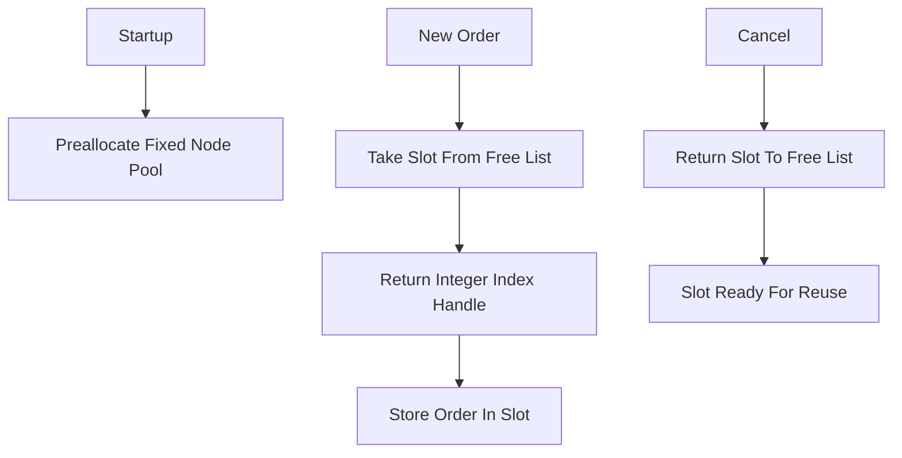

# Slab Allocator / Order Pool

**What it is.** A pre-allocated pool of fixed-size order-node slots handed out by integer index instead of calling the system allocator for every new order.

**When to pick this.** Your book churns through millions of short-lived orders and you want to avoid two problems: allocator latency spikes and heap fragmentation (free gaps the allocator cannot reuse). The slab grabs one big chunk up front, so claiming or releasing a node is O(1) (pop or push a free-list index), and because nodes sit contiguously, they stay cache-friendly. Using small integer handles instead of raw pointers also dodges a class of dangling-pointer bugs.

**When NOT to pick this.** Order volume is low or bursty in unpredictable sizes (a fixed pool either wastes memory or runs out, forcing a grow/spill path), or you want the simplest possible code — a plain `Vec<Order>` is easier when you do not need stable handles across removals.

**Real venue.** No production user known (the technique underpins many in-house HFT engines but is rarely named publicly).

**Recommended crate.** slab (or typed-arena for append-only pools)
