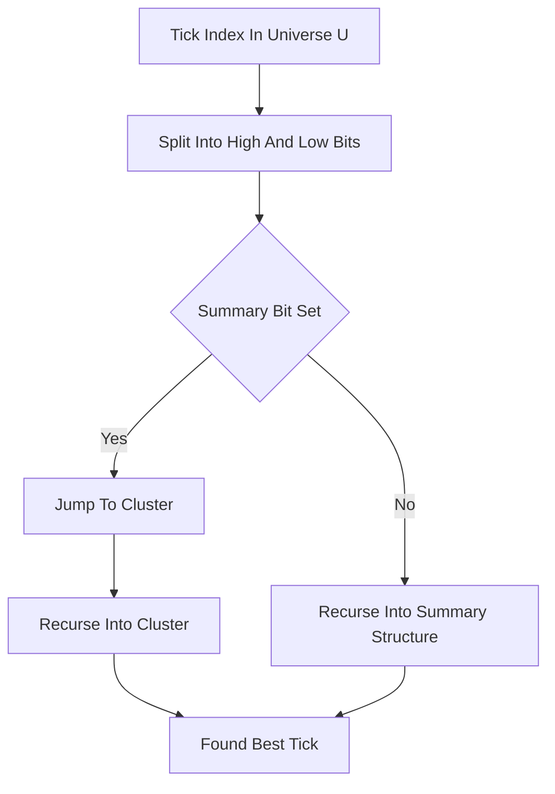

# Van Emde Boas / Y-Fast Trie Book

**What it is.** A limit order book for discrete tick prices stored in a Van Emde Boas tree (or its space-saving cousin, the y-fast trie), which recursively splits the price range into clusters so it can find the next-occupied price extremely fast.

**When to pick this.** Prices live in a bounded integer universe of size U (e.g. all valid ticks between a floor and ceiling), and you need blistering successor/predecessor queries to find the next price level. Insert, cancel, and best-quote all run in O(log log U) time — for a million-tick range that is about 5 steps, far fewer than a tree's log n.

**When NOT to pick this.** The price universe is unbounded or huge and sparse (a raw vEB tree wastes O(U) memory; y-fast trie fixes the space but adds hashing complexity), or you simply do not have enough price levels to justify the intricate, hard-to-debug recursion.

**Real venue.** No production user known.

**Recommended crate.** none — std (specialized; hand-rolled)
