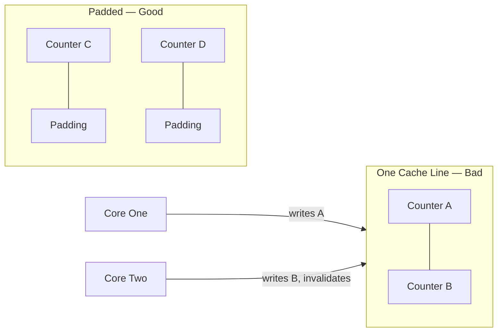

# Cache-Line Padding (False-Sharing Prevention)

**What it is.** CPUs move memory in 64-byte chunks ("cache lines"); if two hot counters share one line, two cores writing them constantly invalidate each other's cache ("false sharing"), so we pad each counter out to its own line.

**When to pick this.** Several threads each hammer their own atomic counter or flag, and profiling shows mysterious slowdowns from cache-line ping-pong.

**When NOT to pick this.** Cold or rarely-written data (padding just wastes memory), or single-threaded code where false sharing cannot happen.

Two variables avoid false sharing iff they sit on different cache lines, i.e. `addr_a / 64 != addr_b / 64`; padding to 64 bytes guarantees it.

**Real venue.** Standard in HFT and high-throughput servers; no production user known for this specific catalog entry.

**Recommended crate.** crossbeam
