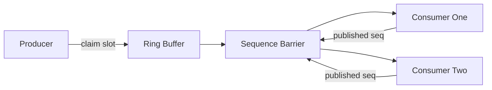

# LMAX Disruptor

**What it is.** A fixed-size circular array (the "ring buffer") whose slots are filled in once at startup, so passing messages between threads needs no new memory allocation and no locks — just bumping a counter (the "sequence").

**When to pick this.** You move millions of small messages per second between a few known threads and want the lowest, most predictable latency; this is Market Forge's default concurrency template (lineage: OrderBook-rs).

**When NOT to pick this.** Low message rates, an unknown/changing number of consumers, or messages too large to pre-allocate — a plain channel is simpler.

A consumer may only read slot `n` once the barrier confirms `published_seq >= n`, so readers never see half-written data.

**Real venue.** LMAX Exchange (the UK trading venue that invented it).

**Recommended crate.** disruptor
