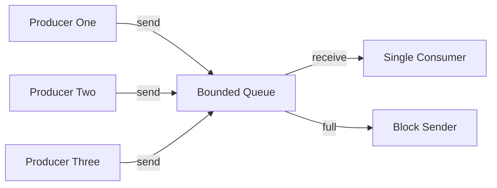

# MPSC with Back-Pressure

**What it is.** A multi-producer single-consumer queue with a fixed capacity: when it fills up, senders are forced to wait ("back-pressure"), which stops fast producers from overwhelming a slower consumer.

**When to pick this.** Several threads submit work (orders, events) to one processor and you want memory bounded and the system to self-throttle under load instead of exploding.

**When NOT to pick this.** Producers must never block (a real-time audio or kernel path), or you genuinely need multiple consumers sharing the stream.

Memory is capped at `capacity` messages; a bounded queue trades some sender stalls for a hard upper bound, unlike an unbounded queue that can grow until it crashes.

**Real venue.** Used across trading and streaming backends; no production user known for this specific catalog entry.

**Recommended crate.** crossbeam
