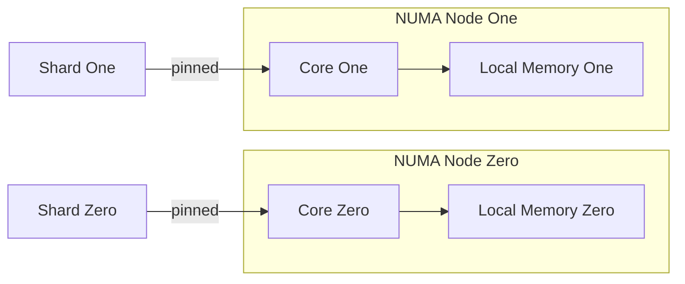

# NUMA-Aware Sharding

**What it is.** On big servers each CPU socket has its own attached RAM ("NUMA node"); this pattern pins each shard's thread to a node and keeps its data in that node's local memory, so a core never reaches across the slow inter-socket link.

**When to pick this.** You run latency-critical shards on a multi-socket box and remote-memory access (often 1.5-2x slower) is showing up in your tail latency.

**When NOT to pick this.** Single-socket machines (no NUMA effect), or threads that must share data across nodes anyway — pinning just adds complexity.

Local access costs `L`; remote costs roughly `r x L` with `r` around 1.5-2, so keeping data local removes that penalty from the hot path.

**Real venue.** HFT firms and Aeron-based systems routinely pin threads to NUMA nodes.

**Recommended crate.** none — std
