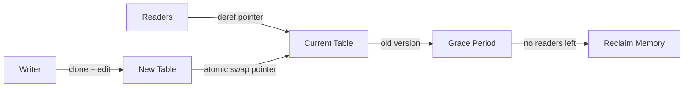

# Read-Copy-Update (RCU)

**What it is.** Read-Copy-Update lets readers use a shared lookup table with zero locking: a writer clones the table, edits the copy, then atomically swaps in a pointer to it, freeing the old copy only after every in-flight reader has finished ("grace period").

**When to pick this.** A reference table (instrument definitions, risk parameters) is read constantly but updated rarely, and readers must never block or wait.

**When NOT to pick this.** Writes are frequent (cloning the whole table each time is wasteful) or you need readers and writers to see changes instantly.

Readers just dereference the current pointer; correctness holds because old memory is reclaimed only after all readers that could hold it are gone.

**Real venue.** The Linux kernel relies on RCU pervasively; financial venues use the same pattern for instrument tables.

**Recommended crate.** none — std
