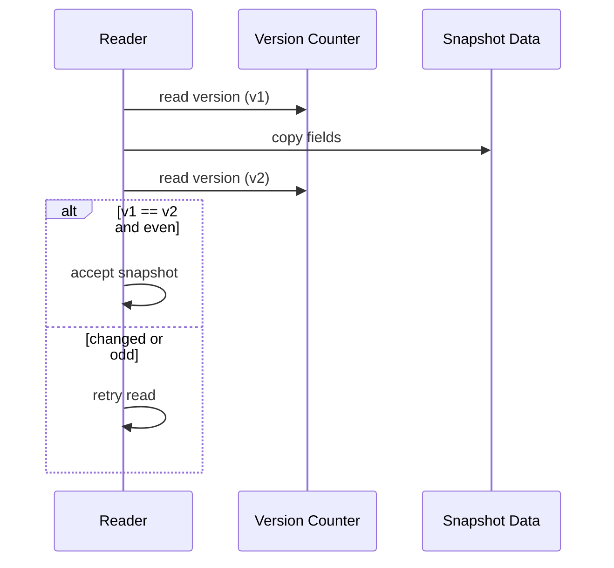

# SeqLock

**What it is.** A "sequence lock" lets readers grab a consistent snapshot without locking: they read a version counter before and after copying, and retry if it changed mid-read.

**When to pick this.** One writer updates a small struct (like a top-of-book price) very often and many readers must see it with almost zero overhead and no blocking.

**When NOT to pick this.** Writes are frequent AND reads are huge/slow (readers livelock retrying), the data is too big to copy cheaply, or readers cannot tolerate occasional retries.

The writer bumps the counter to odd before writing and to even after; readers accept only when `before == after` and even. So a snapshot is valid iff `version_before == version_after` and `version mod 2 == 0`.

**Real venue.** The Linux kernel uses seqlocks for `gettimeofday`.

**Recommended crate.** none — std
