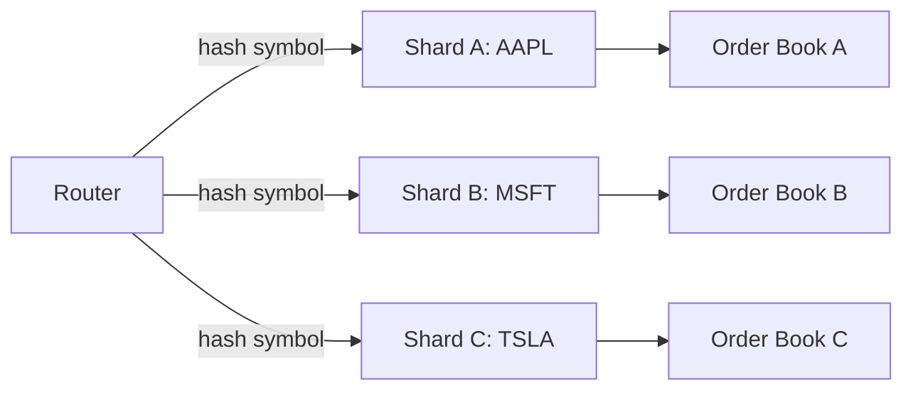

# Sharding by Symbol

**What it is.** Each tradable symbol (e.g. AAPL) is handled by its own dedicated thread or actor, so two different symbols are never processed on the same core and never fight over the same data.

**When to pick this.** Your workload splits cleanly by a key (the symbol) and you want to scale across cores with zero shared-state contention between keys.

**When NOT to pick this.** Work spans symbols (cross-symbol arbitrage, portfolio risk) needing a global view, or one hot symbol dwarfs the rest and overloads its single shard.

Throughput scales roughly linearly: `N` shards give about `N x` capacity until one symbol's traffic saturates its own shard.

**Real venue.** Exchanges like Nasdaq partition matching engines by symbol.

**Recommended crate.** dashmap
