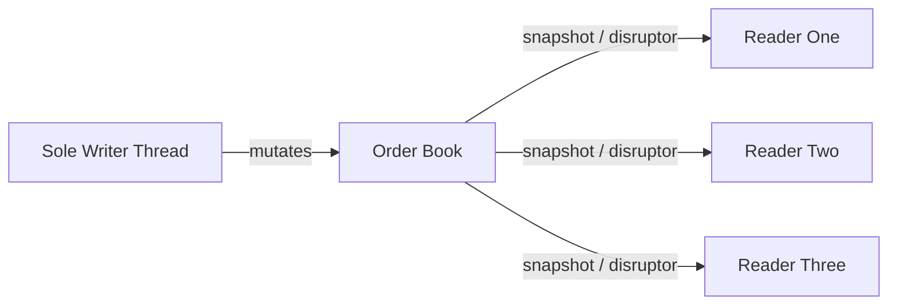

# Single-Writer Principle

**What it is.** Only one thread is ever allowed to modify a piece of state (the order book); everyone else reads via a snapshot or a Disruptor feed, never by writing.

**When to pick this.** A single hot data structure is updated constantly and you want to delete all the locking and contention bugs that come from many writers fighting over it.

**When NOT to pick this.** Write volume genuinely exceeds what one core can handle, or the state naturally partitions — then shard instead.

With one writer there is no write-write contention, so updates cost about `O(1)` with no lock acquisition; only reads fan out.

**Real venue.** LMAX Exchange built its architecture on this principle.

**Recommended crate.** disruptor
