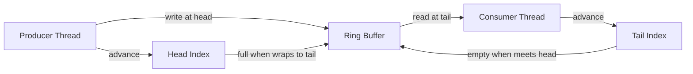

# SPSC Ring Buffer

**What it is.** A single-producer single-consumer queue: exactly one thread writes and one thread reads a fixed circular array, so no locks are needed — each side owns its own index.

**When to pick this.** You have exactly one feed thread handing data to exactly one worker (e.g. a market-data reader feeding a parser) and want the simplest, fastest hand-off.

**When NOT to pick this.** More than one producer or consumer (the no-lock guarantee breaks), or you need blocking/await semantics across many tasks.

It is empty when `tail == head` and full when advancing `head` would reach `tail`, so capacity is `size - 1` slots.

**Real venue.** Ubiquitous in audio engines and exchange feed handlers; no production user known for this specific catalog entry.

**Recommended crate.** crossbeam
