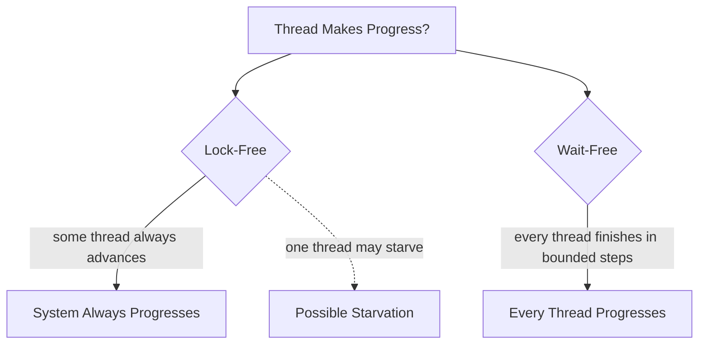

# Wait-Free vs Lock-Free Queues

**What it is.** Two strength levels of lock-less queues: "lock-free" guarantees the system as a whole always makes progress (but one unlucky thread could keep retrying), while "wait-free" guarantees every thread finishes in a bounded number of steps.

**When to pick this.** Wait-free when you need a hard worst-case latency bound per thread (real-time, fairness-critical); lock-free when overall throughput matters and rare starvation is acceptable.

**When NOT to pick this.** Low contention or simple needs — a mutex-backed queue is far easier to reason about and often just as fast.

Wait-free is strictly stronger: every wait-free algorithm is lock-free, but not vice versa; wait-free bounds steps per operation at some constant `k`.

**Real venue.** Used in real-time and trading systems; no production user known for this specific catalog entry.

**Recommended crate.** crossbeam
