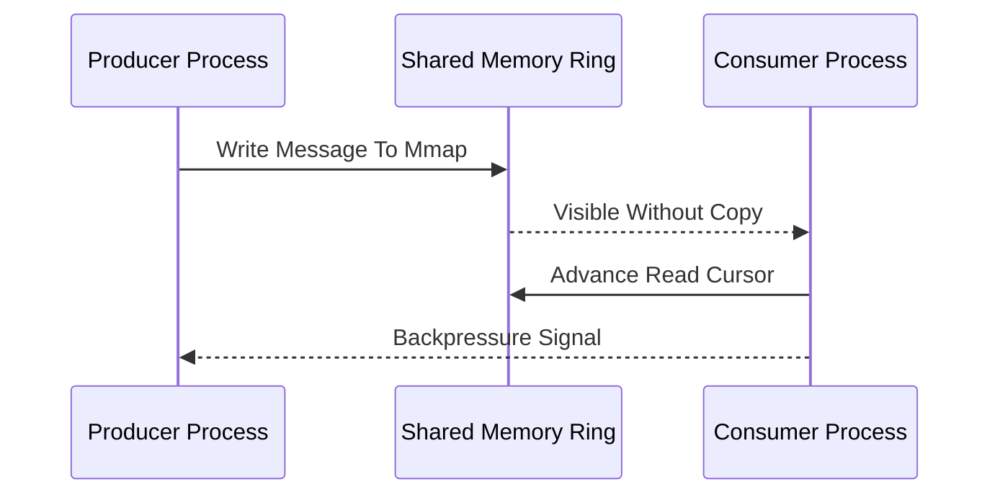

# Aeron / Chronicle IPC

**What it is.** Ultra-low-latency messaging between processes (IPC — inter-process communication) over a shared, memory-mapped ring buffer, so a message passes from one process to another in well under a microsecond without a kernel round-trip.

**When to pick this.** You split the system into separate processes (gateway, matching engine, risk) for isolation but still need them to talk at near-thread speed. A memory-mapped ring means the consumer reads exactly the bytes the producer wrote — no serialization, no socket, no copy.

**When NOT to pick this.** Processes on different machines (you need a network transport then) or low-frequency control messages where a plain socket or channel is plenty.

**When to skip (category note).** Home-lab and educational venues should keep this OFF by default; a single-process design with in-memory channels is simpler and just as instructive.

**Real venue.** Aeron is used by major exchanges and trading firms (Adaptive Financial Consulting built it); Chronicle Queue serves the same niche.

**Recommended crate.** disruptor (single-writer ring within a process); pair with `memmap2` for the cross-process shared segment.
