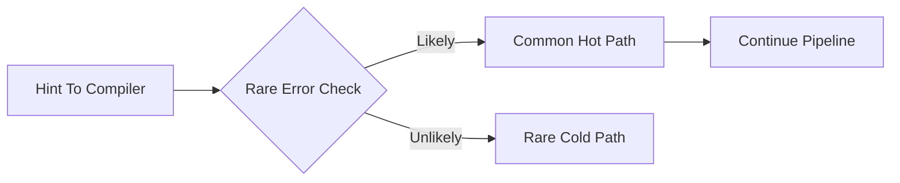

# Branch-Prediction Hints

**What it is.** Telling the compiler which side of an `if` is almost always taken, so it lays out the machine code to keep the common path straight-line and the CPU's branch predictor rarely guesses wrong.

**When to pick this.** A hot loop has a branch that is overwhelmingly one-sided — e.g. an error or capacity check that almost never fires. A mispredicted branch flushes the CPU pipeline, costing ~15-20 cycles; hinting the rare side as `unlikely` keeps the predictor warm. Use `core::hint::likely` / `unlikely`.

**When NOT to pick this.** Branches that are genuinely 50/50 (the predictor does better than you), or anywhere outside a measured hot path — a wrong hint actively slows code down.

**When to skip (category note).** Home-lab and educational venues should keep this OFF by default; it's a micro-optimization that obscures code and only matters under a profiler.

**Real venue.** no production user known (the Linux kernel's `likely`/`unlikely` macros are the canonical inspiration).

**Recommended crate.** none — std (`core::hint::likely` / `core::hint::unlikely`).
