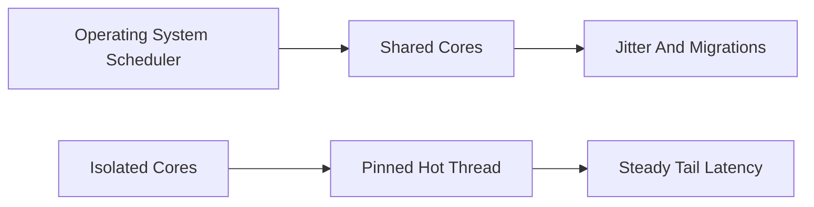

# CPU Pinning (isolcps / nohz_full)

**What it is.** Permanently binding your latency-critical threads to specific CPU cores that the OS has been told to leave alone, so the scheduler never migrates them or interrupts them with other work.

**When to pick this.** Your throughput is fine but the *tail* — the slowest 0.1% of operations (p99.9 latency) — spikes because the OS moved your thread to a cold core or fired a timer interrupt on it. `isolcpus` removes cores from the general scheduler; `nohz_full` stops the periodic timer tick on them.

**When NOT to pick this.** Throughput-bound or bursty workloads — pinning wastes whole cores sitting idle between bursts and gives up the scheduler's load balancing.

**When to skip (category note).** Home-lab and educational venues should keep this OFF by default; it requires kernel boot flags and a tuned host, far beyond a laptop demo.

**Real venue.** Citadel Securities and other HFT shops boot with `isolcpus`/`nohz_full` and pin matching threads.

**Recommended crate.** core_affinity (sets thread-to-core affinity from Rust; the `isolcpus` part is a kernel boot parameter, not a crate).
