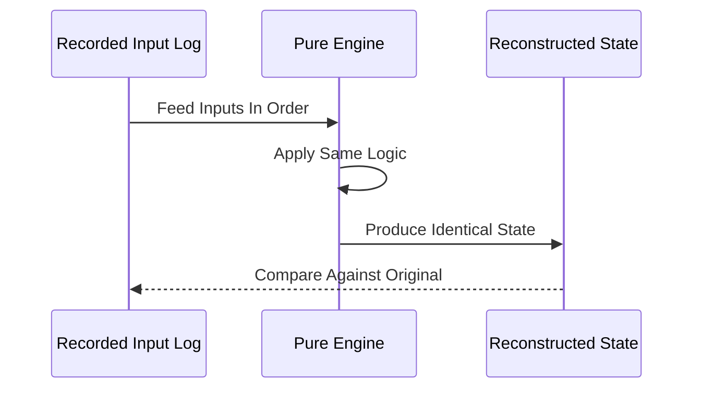

# Deterministic Replay

**What it is.** Designing the engine so that the same sequence of inputs always produces the exact same output state — no hidden randomness, no wall-clock reads, no thread-timing dependence.

**When to pick this.** You need to audit "how did we reach this state?", reproduce a production bug locally, or prove correctness — just replay the recorded input log and the state reconstructs bit-for-bit. Formally: `state = fold(initial, inputs)` is a pure function.

**When NOT to pick this.** Systems that legitimately depend on real time or external nondeterminism and where reproducibility isn't worth threading every clock and RNG through an injectable seam.

**When to skip (category note).** Home-lab venues can keep strict determinism OFF by default; it's a discipline that constrains your code everywhere, and a teaching engine rarely needs courtroom-grade audit.

**Real venue.** LMAX Exchange replays its input event stream to reproduce exact engine state for testing and audit.

**Recommended crate.** loom (to verify your concurrency has no nondeterministic interleavings); the determinism itself is "none — std".
