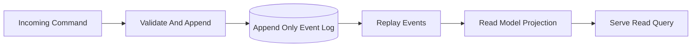

# Event Sourcing + CQRS

**What it is.** A storage pattern where the immutable list of past events is the only source of truth, and any queryable view (the "book", i.e. the current state) is a *projection* rebuilt by replaying those events.

**When to pick this.** You need a perfect audit trail, time-travel debugging, or the ability to derive new read-shapes later without losing history. CQRS (Command Query Responsibility Segregation — separating the write path from the read path) lets writes and reads scale and evolve independently.

**When NOT to pick this.** Simple CRUD apps where the current state is all you ever need — the extra machinery (event versioning, projection rebuilds, eventual consistency between write and read sides) is pure overhead.

**When to skip (category note).** Most educational and home-lab venues should leave this OFF by default; a plain in-memory book with a log file gives the same learning value without the operational weight.

**Real venue.** LMAX Exchange, whose Disruptor-based engine treats the event stream as truth and rebuilds order-book state by replay.

**Recommended crate.** disruptor (for the single-writer event ring); pair with rkyv for fast event encoding.
