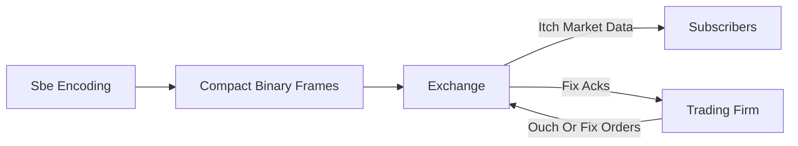

# FIX / ITCH / OUCH / SBE Protocols

**What it is.** A family of standard wire formats institutions speak to exchanges: FIX (a tag-value session protocol for orders), ITCH (a binary market-data feed), OUCH (a binary order-entry feed), and SBE (Simple Binary Encoding, a compact zero-overhead layout).

**When to pick this.** You want your venue to interoperate with real institutional clients or to feel realistic. ITCH/OUCH (pioneered by Nasdaq) and SBE are binary and fast; FIX is text-ish, ubiquitous, and human-debuggable.

**When NOT to pick this.** Internal-only systems where you control both ends — a custom message type is simpler than implementing a spec with sessions, sequence numbers, and recovery.

**When to skip (category note).** Educational and home-lab venues should keep this OFF by default; implementing a real protocol is a large effort that teaches plumbing, not market mechanics.

**Real venue.** Nasdaq publishes and runs the ITCH and OUCH protocols; FIX is used market-wide.

**Recommended crate.** n/a (off-chain/math) — protocol codecs live outside the core engine; encode frames with rkyv-style layouts or a dedicated FIX library.
