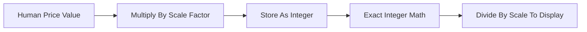

# Fixed-Point Decimals

**What it is.** Representing money as exact integers (or a decimal type) instead of binary floating point (`f64`), because `f64` cannot represent values like 0.10 precisely and accumulates rounding error.

**When to pick this.** Any time you handle money or quantities that must balance to the cent. The trick: pick a *scale* and store `value * 10^scale` as an integer — e.g. with scale 4, $12.34 becomes the integer 123400, and adding two prices is exact integer addition.

**When NOT to pick this.** Purely statistical or physics-style math (volatility surfaces, Greeks) where tiny floating error is acceptable and `f64` speed matters — keep those off-chain in floats.

**When to skip (category note).** This is the one infra item home-lab venues should keep ON; getting money wrong teaches the wrong lesson. Skip the heavyweight decimal crate, not the concept — scaled integers are fine.

**Real venue.** Coinbase and most crypto exchanges store balances as scaled integers (base units / satoshis) to avoid float error.

**Recommended crate.** rust_decimal (128-bit base-10 decimal; the `fixed` crate or plain scaled `i64`/`i128` work for hot paths).
