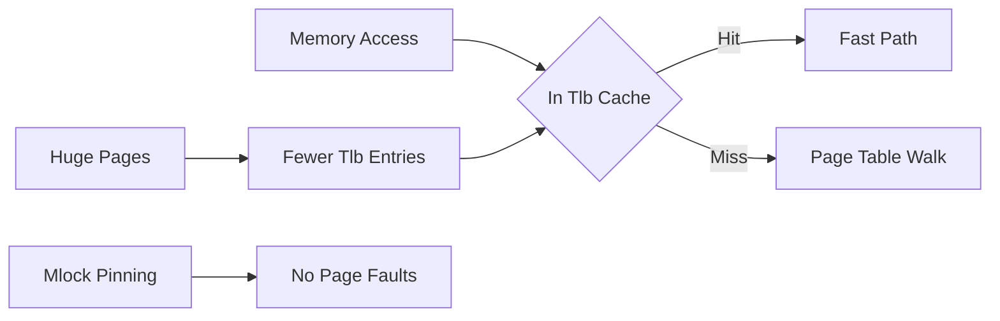

# Huge Pages / mlock

**What it is.** Two memory tricks: using large memory pages (2 MB instead of 4 KB) so the CPU's address-lookup cache (the TLB) covers more memory, and `mlock` to pin pages in RAM so the OS never swaps them to disk mid-operation.

**When to pick this.** Your hot data set is large and you see latency spikes from TLB misses (the CPU stalling to walk page tables) or from a page fault when touched memory had been paged out. A miss can cost hundreds of cycles; a fault, far more.

**When NOT to pick this.** Small working sets that already fit in the TLB, or memory-constrained hosts where pinning pages starves everything else.

**When to skip (category note).** Educational and home-lab venues should keep this OFF by default; it needs OS configuration and only pays off at scale.

**Real venue.** no production user known (commonly used across HFT but rarely named publicly).

**Recommended crate.** none — std (huge pages and `mlock` are OS facilities, configured via the kernel and `libc` calls).
