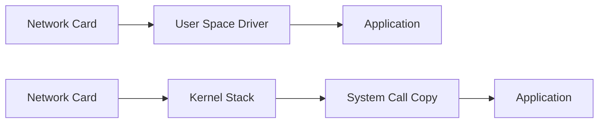

# Kernel-Bypass Networking

**What it is.** Moving network packet handling out of the operating-system kernel and into your own process, so data goes straight from the network card to your code without per-packet system calls and copies.

**When to pick this.** You're chasing single-digit-microsecond latency and the kernel's TCP/IP stack (context switches, buffer copies, interrupt handling) is now your bottleneck. `io_uring` is the gentler, Linux-native step; DPDK/Onload are the full bypass.

**When NOT to pick this.** Anything that isn't latency-critical — bypass means you give up the kernel's batteries-included networking and must handle retransmits, flow control, and NIC quirks yourself.

**When to skip (category note).** Educational and home-lab venues should keep this OFF by default; it needs special hardware/drivers and turns a one-line socket into a research project.

**Real venue.** Jump Trading and Jane Street use Solarflare/Onload kernel-bypass NICs for low-latency market access.

**Recommended crate.** none — std for ordinary sockets; reach for tokio-uring or glommio (both wrap Linux `io_uring`) when you need the bypass.
