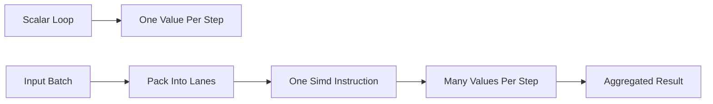

# SIMD Batch Compute

**What it is.** SIMD (Single Instruction, Multiple Data) means one CPU instruction operates on a whole batch of numbers at once — e.g. multiplying eight prices by eight quantities in a single step instead of eight.

**When to pick this.** You repeat the same arithmetic over many items: marking a portfolio to market, summing PnL (profit-and-loss) across positions, or aggregating a mark price. Throughput scales with the lane width: an 8-wide vector can approach 8x the scalar rate. `state.simd` / the `wide` crate expose this safely.

**When NOT to pick this.** Branchy, irregular logic or small batches — the cost of packing data into vectors and the loss of readability outweigh the gain.

**When to skip (category note).** Educational and home-lab venues should keep this OFF by default; a plain loop is clearer and the autovectorizer often handles the easy cases for free.

**Real venue.** no production user known (the `wide` crate is widely used for batch finance math, but specific desks rarely disclose).

**Recommended crate.** none — std (`std::simd`, currently nightly); the `wide` crate is the stable alternative.
