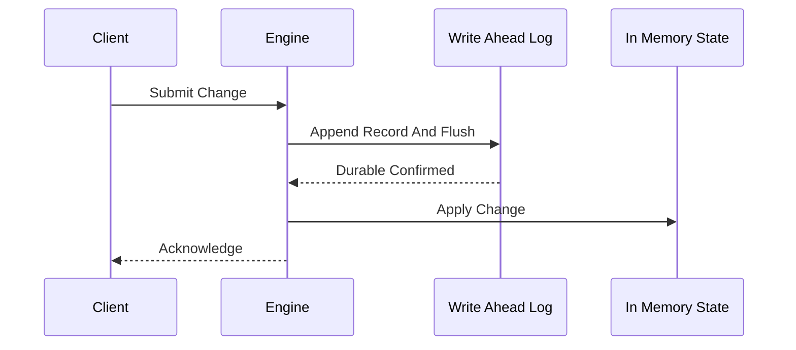

# Write-Ahead Log (WAL)

**What it is.** A durability technique where every change is written (and flushed to disk) to an append-only log *before* the system acknowledges it, so nothing accepted can ever be lost.

**When to pick this.** You must survive a crash without losing accepted writes, and you want recovery to be a simple replay of the log from the last checkpoint. Memory-mapped logs (Aeron/Chronicle-style) make the append nearly as cheap as a memory write.

**When NOT to pick this.** Purely ephemeral or recomputable data — if losing the last second of state is harmless, the per-write flush cost (an `fsync`, often hundreds of microseconds) is wasted.

**When to skip (category note).** Home-lab and teaching venues should keep this OFF by default; a periodic snapshot is simpler and the durability guarantee is rarely needed for a toy book.

**Real venue.** Chronicle Software's Chronicle Queue, used by trading firms for memory-mapped persisted message logs.

**Recommended crate.** none — std (`std::fs` + `memmap2` for the mmap path; the log itself is plain file I/O).
