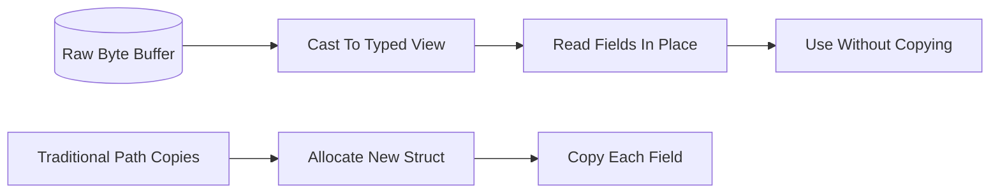

# Zero-Copy Serialization

**What it is.** A way to read structured data directly out of a byte buffer by treating the bytes *as* the struct, instead of allocating a new object and copying every field into it.

**When to pick this.** You receive large or high-frequency messages (market data feeds, IPC frames) and the copy + parse step shows up in your latency profile. Zero-copy turns deserialization cost from O(fields) into roughly O(1) — a pointer cast and a validation check.

**When NOT to pick this.** Small, infrequent messages, or when you need to mutate the decoded data freely — the rigid memory layout and unsafe-adjacent rules add complexity that buys you nothing at low volume.

**When to skip (category note).** Educational and home-lab venues should keep this OFF by default; `serde_json` is slower but vastly easier to read and debug.

**Real venue.** Discord uses rkyv to cache and serve message data with near-zero deserialization overhead.

**Recommended crate.** rkyv (archive types you can read in place; flatbuffers/capnp are the C++-world equivalents).
