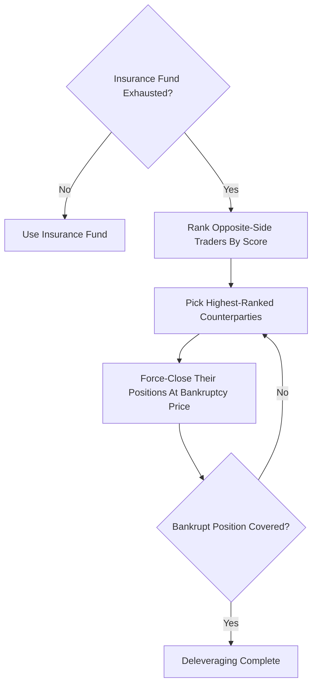

# Auto-Deleveraging (ADL)

**What it is.** When the insurance fund runs dry, the exchange force-closes the most profitable, highest-leverage traders on the opposite side to absorb a bankrupt position the fund can no longer cover.

**ADL** is the last automated line before socializing losses. Each trader gets a ranking score; the top-ranked are deleveraged first.

**When to pick this.** Leveraged derivatives venues that want losses contained to the riskiest winners rather than spread across everyone.

**When NOT to pick this.** Venues that promise traders their positions will never be touched (institutional venues with strong margin requirements) — ADL surprises winners and hurts trust.

Ranking score is `pnl_percentage * effective_leverage`, so big winners betting big get deleveraged first.

**When NOT to pick this.** Skip if the insurance fund is deep enough to never deplete — ADL then adds complexity for no benefit.

**Real venue.** Bybit and OKX both publish live ADL ranking indicators.

**Recommended crate.** dashmap — a concurrent map of per-trader scores lets the engine rank and update counterparties under load.
