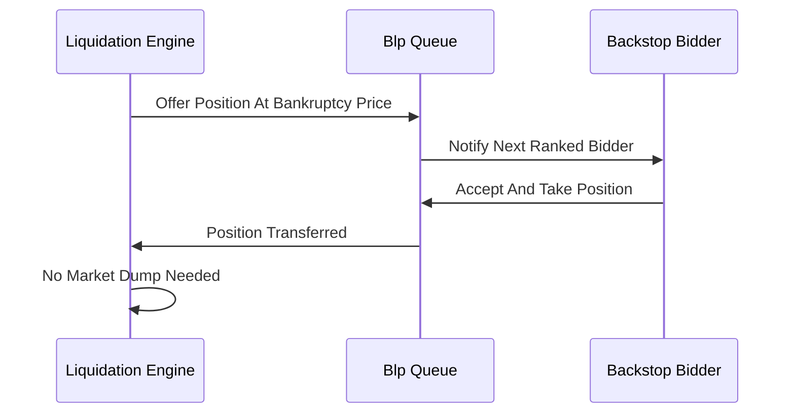

# Backstop Liquidity Provider (BLP) Queues

**What it is.** A pre-registered set of professional firms (backstop bidders) who agree to take over liquidated positions directly at the bankruptcy price, so the engine never has to dump them onto the open market.

**When to pick this.** Venues where forced selling into a thin order book would crash the price — handing positions to committed backstop firms avoids market impact entirely.

**When NOT to pick this.** Markets deep enough to absorb liquidations directly, or where you cannot recruit reliable backstop firms — an empty queue is worse than no queue.

Bidders are tried in ranked order until one accepts; each provides standing capital in exchange for taking risk at favorable prices.

**When NOT to pick this.** Avoid if regulatory rules require open, non-privileged liquidation auctions.

**Real venue.** dYdX v4 uses backstop liquidity providers for liquidations.

**Recommended crate.** crossbeam — a multi-producer queue routes offered positions to ranked backstop bidders concurrently.
