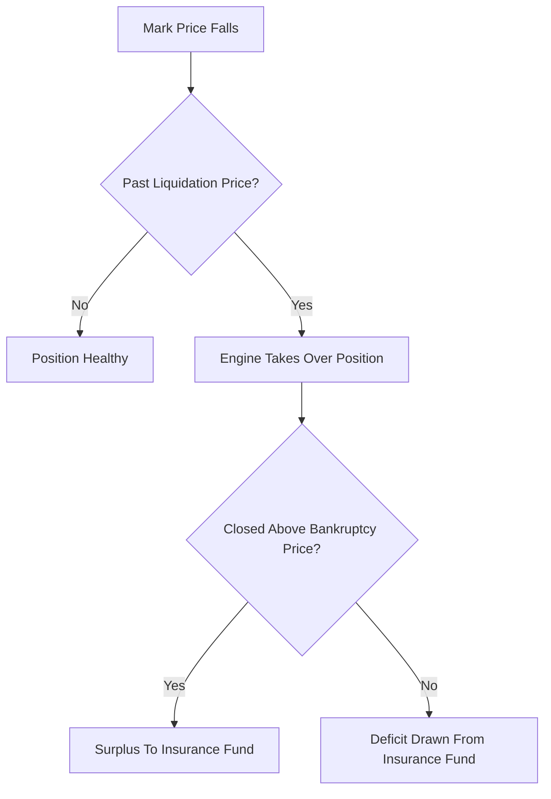

# Bankruptcy Price / Insurance-Fund Trigger

**What it is.** A rule that separates two price levels — the **liquidation price** (where the engine takes over your position) and the **bankruptcy price** (where your collateral is fully gone) — and uses the insurance fund to absorb the gap between them.

The liquidation price leaves a small buffer above zero collateral. If the engine closes the seized position *better* than the bankruptcy price, the leftover buffer feeds the insurance fund; if *worse*, the fund covers the shortfall.

**When to pick this.** Leveraged venues that want a clean, deterministic boundary for when the house's safety fund is tapped.

**When NOT to pick this.** Fully-collateralized or over-collateralized systems where positions can never go negative — there is no gap to insure.

Roughly: `liquidation_price > bankruptcy_price` for longs; the difference funds or drains insurance.

**When NOT to pick this.** Skip if you have no insurance fund at all — then auto-deleveraging is the direct fallback.

**Real venue.** BitMEX pioneered the liquidation-vs-bankruptcy-price split.

**Recommended crate.** rust_decimal — exact price-level arithmetic prevents mispricing the insurance trigger.
