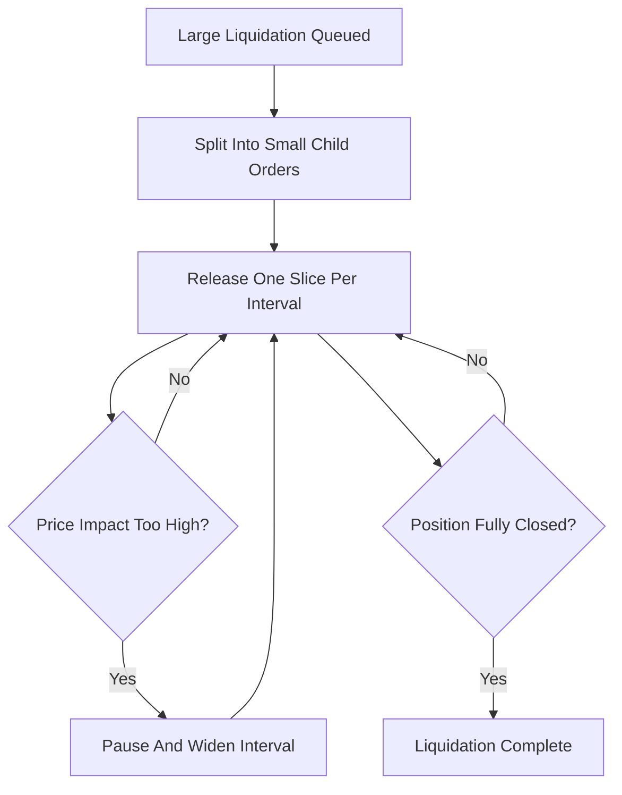

# Liquidation Cascade Prevention

**What it is.** Logic that feeds a big forced sale into the market in small timed slices instead of all at once, so the selling does not crash the price and trigger more liquidations.

A **cascade** is a feedback loop: a large liquidation pushes the price down, which puts more accounts underwater, which triggers more liquidations, and so on. **TWAP** (time-weighted average price) means spreading the order evenly over time.

**When to pick this.** Venues with concentrated positions or thin order books, where a single dump could spiral into a market-wide crash.

**When NOT to pick this.** Deep, highly liquid markets where any single position is small relative to volume — throttling just delays the inevitable and adds risk while the position bleeds.

Slice size targets a price impact cap: `slice_size <= max_impact * book_depth`.

**When NOT to pick this.** Also skip when speed of solvency matters more than price — a fast-moving gap-down may demand immediate full closure.

**Real venue.** dYdX v4 throttles liquidations to limit price impact.

**Recommended crate.** tracing — observability into per-slice timing and impact is essential for tuning the throttle.
