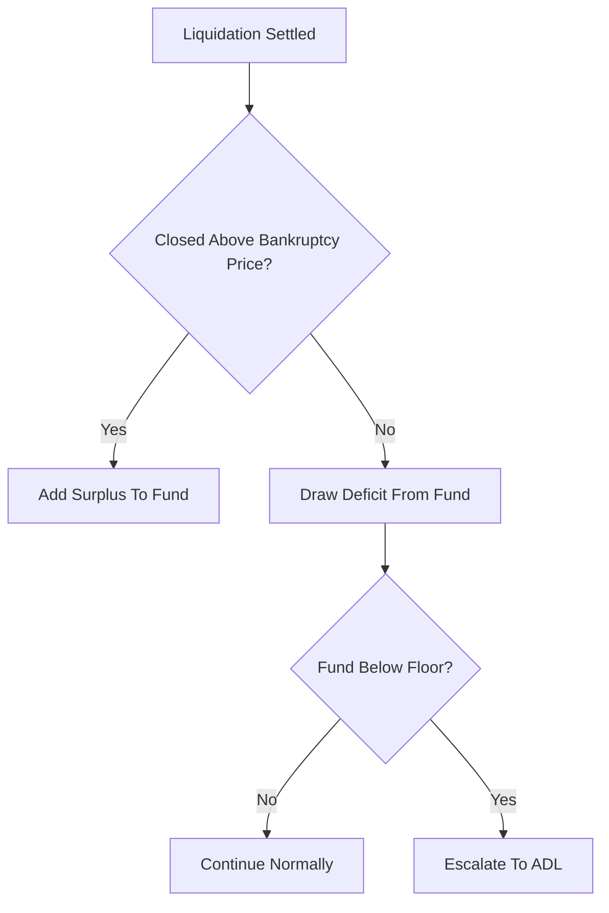

# Insurance Fund Management

**What it is.** The policy governing a shared safety pool that collects the leftover buffer from well-executed liquidations and pays out to cover the shortfall from badly-executed ones, keeping the exchange solvent.

**When to pick this.** Any leveraged venue that wants a buffer between individual bankruptcies and drastic measures like auto-deleveraging — the fund absorbs normal liquidation noise.

**When NOT to pick this.** Fully-collateralized systems with no negative-equity risk, where there is nothing for a fund to cover.

The fund grows by liquidation surpluses and shrinks by deficits: `fund += surplus` on good closes, `fund -= deficit` on bad ones. A floor threshold triggers escalation to ADL before it hits zero.

**When NOT to pick this.** Avoid hand-rolling this if a regulated custodian already guarantees deposits — duplicating coverage adds risk.

**Real venue.** Binance and Bybit publish daily insurance-fund balances.

**Recommended crate.** parking_lot — a fast mutex guards the single shared fund balance against concurrent liquidation updates.
