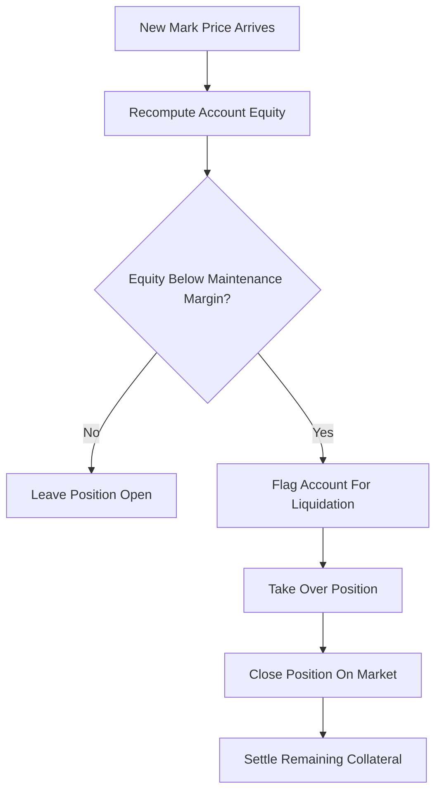

# Liquidation Engine

**What it is.** A system that, on every new "mark price" (the reference price used to value open positions), re-checks each leveraged account and forcibly closes positions whose collateral has dropped below the required safety cushion.

**When to pick this.** Any venue offering leverage (borrowed buying power) — futures, perpetuals, margin lending — needs this to stop an account's losses from exceeding its deposited collateral and leaving the exchange holding the bag.

**When NOT to pick this.** Pure spot trading with no borrowing: you can only lose what you already own, so there is nothing to liquidate.

**Maintenance margin** is the minimum collateral you must keep. Liquidate when `equity < position_size * maintenance_margin_rate`, where `equity = collateral + unrealized_pnl`.

**When NOT to pick this.** Also skip if positions are fully prepaid (options buyers paying full premium upfront) — risk is bounded at entry.

**Real venue.** Binance Futures runs a continuous mark-price liquidation engine.

**Recommended crate.** rust_decimal — margin math must be exact; floating-point rounding errors here directly cause wrong liquidations.
