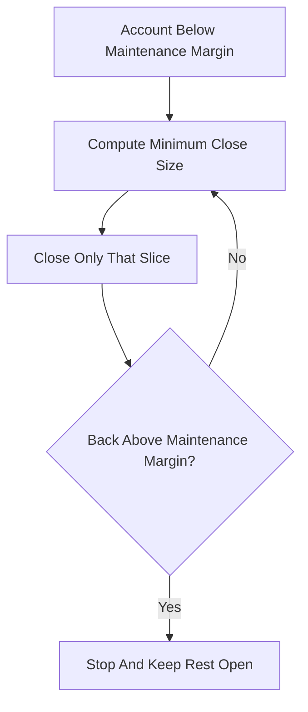

# Partial Liquidation

**What it is.** Instead of dumping a trader's entire position when they breach the safety cushion, the engine closes only the smallest slice needed to bring the account back above its required collateral level.

**When to pick this.** Large positions where a full close would move the market against the trader (and the exchange) — partial closing keeps more of the position alive and is fairer to the user.

**When NOT to pick this.** Tiny accounts where the leftover position is dust, or low-liquidity markets where computing and executing many small closes costs more than it saves — a single full close is simpler.

The slice to close solves `equity_after >= remaining_size * maintenance_margin_rate`; close the minimum `delta` that satisfies this, leaving the rest open.

**When NOT to pick this.** Also avoid if your matching engine cannot atomically reduce a position — repeated partial fills can race with new orders and corrupt position state.

**Real venue.** dYdX and BitMEX both use tiered partial liquidation.

**Recommended crate.** rust_decimal — the close-size solve must be exact to avoid over- or under-liquidating.
