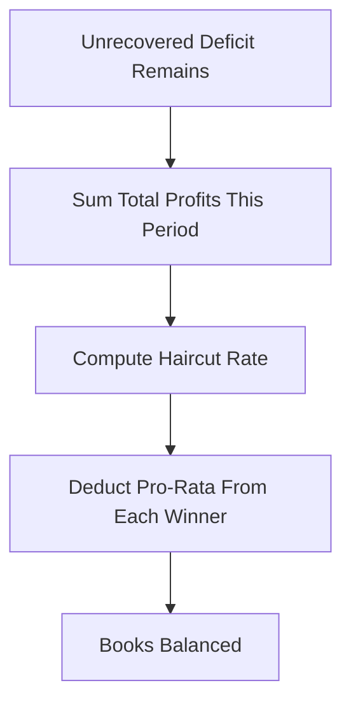

# Socialized Loss

**What it is.** The absolute last resort: when a bankrupt position still cannot be covered after the insurance fund and auto-deleveraging, the leftover deficit is spread proportionally across all traders who made a profit that period — a "haircut" on their gains.

**When to pick this.** Early-stage or thin derivatives venues that cannot guarantee a deep enough insurance fund and need a mathematically guaranteed way to keep the books balanced (total wins must equal total losses).

**When NOT to pick this.** Mature venues with large insurance funds and ADL — socialized loss badly damages trust because even careful, profitable traders lose money through no fault of their own.

Each winner pays `their_profit * (deficit / total_profits)`, so the haircut is strictly proportional.

**When NOT to pick this.** Avoid wherever regulation or user expectations forbid clawing back realized profits.

**Real venue.** Early BitMEX and OKEx used socialized-loss clawbacks before insurance funds matured.

**Recommended crate.** rust_decimal — the pro-rata haircut must sum exactly to the deficit with no rounding leakage.
