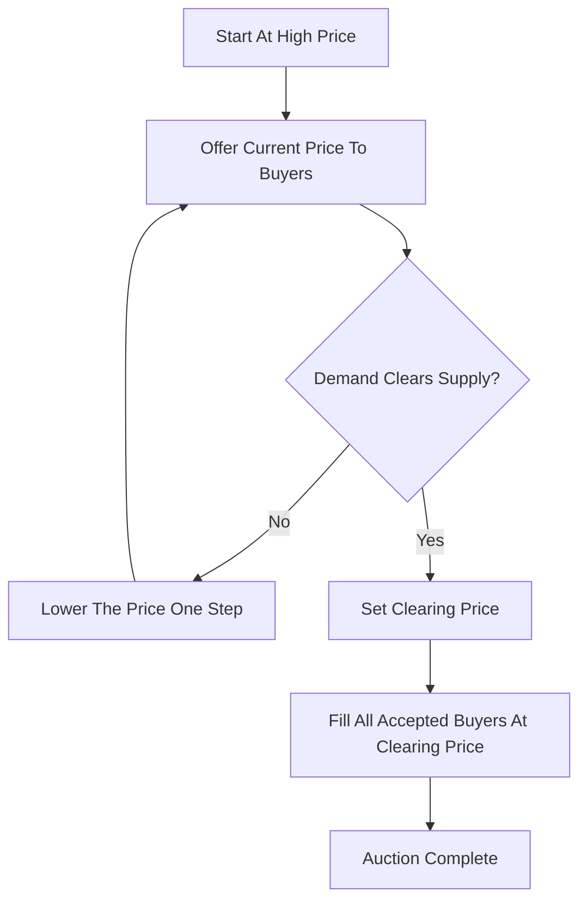

# Dutch Auction

**What it is.** The price starts high and ticks downward until enough buyers accept to absorb the whole supply, and everyone pays that final clearing price.

**When to pick this.** Liquidating a large block or issuing supply (treasury bills, token sales) where you want the market to discover the highest price that still sells the full amount.

**When NOT to pick this.** Continuous two-sided trading of liquid instruments — the descending-clock format only fits one-shot, sell-a-fixed-quantity events.

**Real venue.** U.S. Treasury auctions and Google's 2004 IPO used Dutch-auction pricing.

**Recommended crate.** `rust_decimal` — exact decimal price steps as the clock descends, so the clearing price `p` where `cumulative_demand(p) >= supply` is computed without rounding error.
