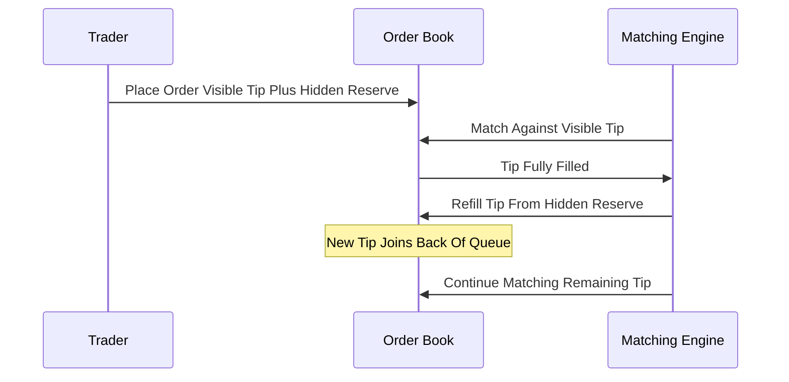

# Iceberg / Reserve Order Matching

**What it is.** A large order shows only a small visible "tip" in the public book while keeping the bulk as hidden reserve; each time the tip fully fills, a fresh tip is sliced off the reserve.

**When to pick this.** A trader wants to move size without revealing it — broadcasting the full quantity would scare the market and move the price against them.

**When NOT to pick this.** Fully transparent or auction markets where hidden liquidity violates the rules, and venues where refilled tips losing queue position frustrate users.

**Real venue.** Nasdaq, Eurex, and most major exchanges offer iceberg/reserve order types.

**Recommended crate.** `slab` — cheap stable slots to re-insert each refreshed tip at the queue tail without reallocating the parent order.
