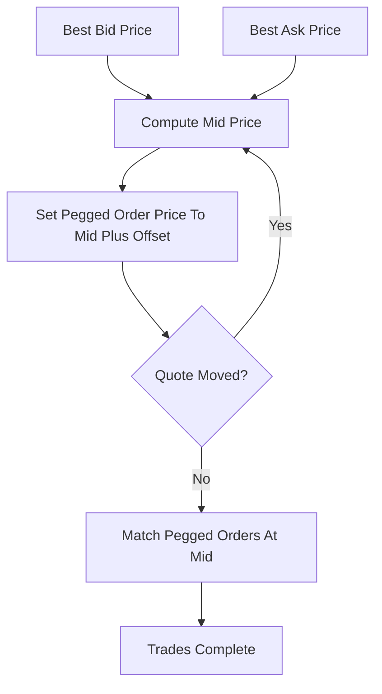

# Pegged Orders / Mid-Point Match

**What it is.** An order whose price is not fixed but tracks a moving reference — usually the mid-point between best bid and best ask, `mid = (best_bid + best_ask) / 2`, optionally plus an offset — and reprices automatically as the market moves.

**When to pick this.** Traders wanting to buy/sell at the fair middle price without constantly re-entering orders, and venues running hidden mid-point pools for size-sensitive flow.

**When NOT to pick this.** Markets with no reliable bid/ask reference (illiquid or single-sided books) where there is no stable mid to peg to.

**Real venue.** Nasdaq mid-point peg orders and dark pools like UBS ATS.

**Recommended crate.** `parking_lot` — fast mutex/RwLock to guard the shared best-bid/best-ask reference that many pegged orders re-read on every quote update.
