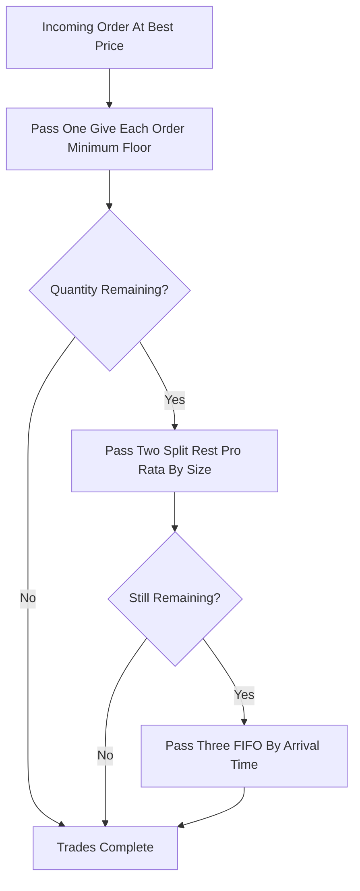

# Price-Size-Time (Size-Pro-Rata Hybrid)

**What it is.** A pro-rata split (proportional to order size) that first guarantees every resting order a small minimum quantity, then allocates the rest by size, and breaks any final remainder by arrival time.

**When to pick this.** Pro-rata markets where pure proportional fills starve small orders; the floor keeps small participants engaged while size still earns the bulk.

**When NOT to pick this.** Simple spot books where plain FIFO is clearer, or when traders find the three-pass rule too opaque to plan around.

**Real venue.** CME uses this size-pro-rata-with-floor style on several futures products.

**Recommended crate.** `rust_decimal` — exact decimal math for the floor allocation plus the proportional remainder `share_i = leftover * (size_i / sum_sizes)` without rounding drift.
