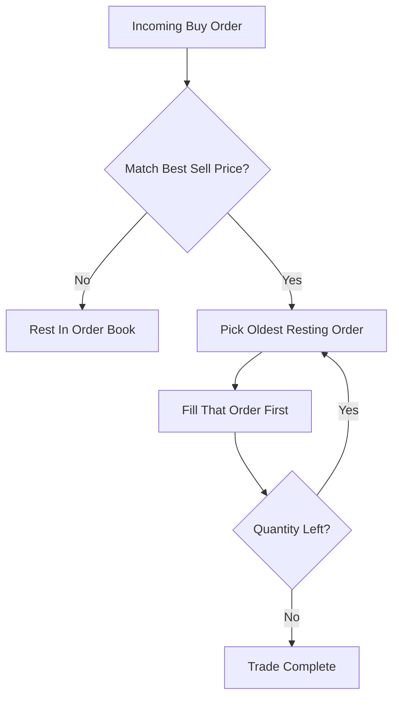

# Price-Time Priority (FIFO)

**What it is.** The classic central limit order book (CLOB, the shared list of all buy/sell offers) where an incoming order matches the best available price, and among equal-priced resting orders the one that arrived earliest fills first.

**When to pick this.** Default for almost everything — equities, crypto spot, anything where rewarding the trader who showed up first is fair and easy to reason about.

**When NOT to pick this.** Markets where being microseconds faster wins every queue spot, which pushes participants into a latency arms race; some derivatives venues use pro-rata instead to dampen that.

**Real venue.** NYSE, Nasdaq, and most crypto spot exchanges (Coinbase, Binance).

**Recommended crate.** `slab` — stable integer-keyed slots for storing resting orders in price-level queues without per-order allocation.
