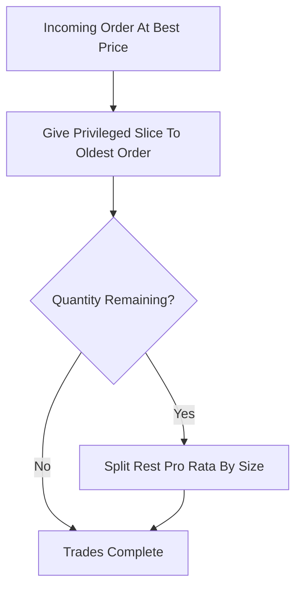

# Pro-Rata with TOP

**What it is.** Pro-rata matching (fills split proportional to order size) with one twist: the first/oldest order resting at the price level gets a guaranteed privileged slice before the proportional split begins.

**When to pick this.** Pro-rata venues that still want to reward being first to a price — the TOP slice restores a little time priority without a full speed race.

**When NOT to pick this.** Markets where a single early order grabbing a fixed cut feels unfair, or simple books where one consistent rule (plain FIFO or plain pro-rata) is easier to explain.

**Real venue.** CME applies a TOP (also called "first-in-first-out priority") allocation on selected interest-rate futures.

**Recommended crate.** `rust_decimal` — exact arithmetic for the TOP carve-out then the proportional remainder `share_i = (total - top) * (size_i / sum_sizes)`.
