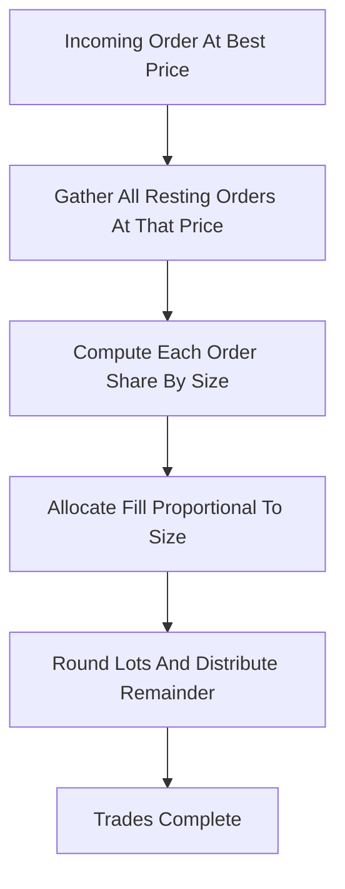

# Pro-Rata Matching

**What it is.** When an order hits the best price, the available quantity is split across every resting order at that price in proportion to each order's size, instead of giving it all to the earliest one.

**When to pick this.** Markets where many orders cluster at one price (the queue is huge), so time priority would be a pure speed race; spreading fills by size rewards posting more quantity instead.

**When NOT to pick this.** Thin books or retail venues — pro-rata encourages oversized "phantom" orders gaming the proportion, and is harder for newcomers to predict.

**Real venue.** CME Eurodollar and other short-term interest-rate futures.

**Recommended crate.** `rust_decimal` — exact base-10 arithmetic so the proportional split `fill_i = total * (size_i / sum_sizes)` never drifts from rounding errors.
